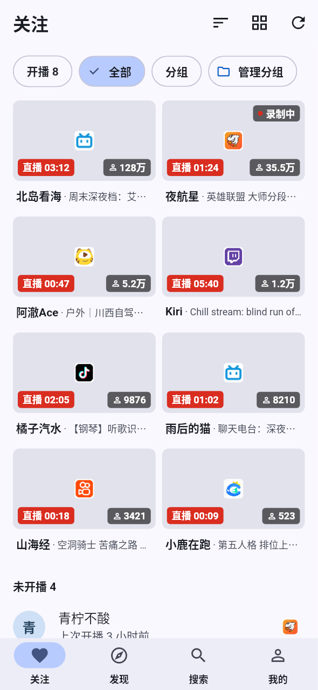
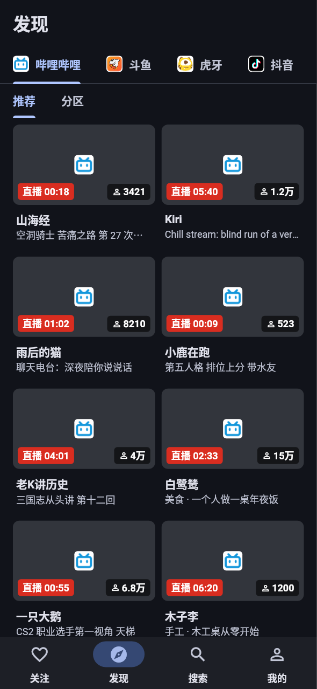
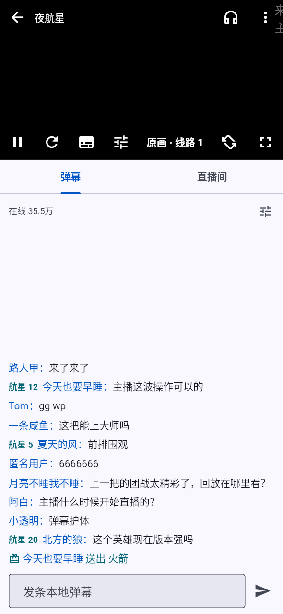
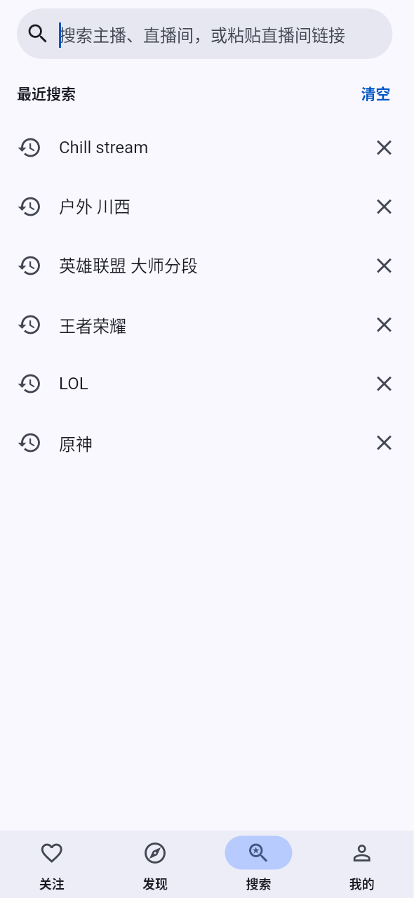
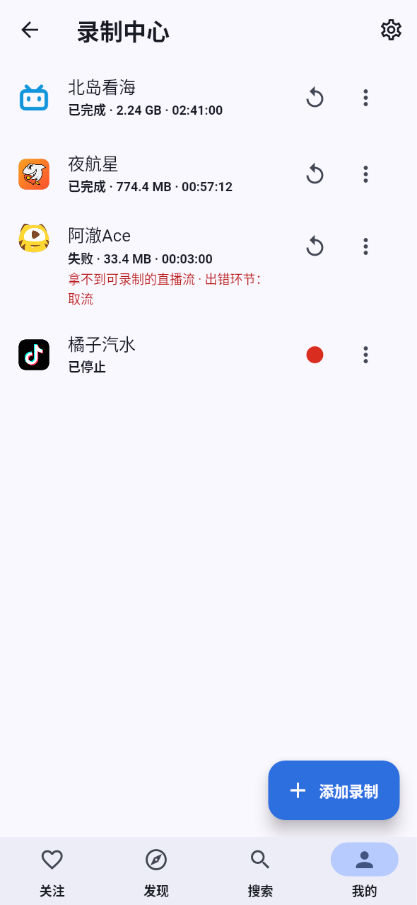
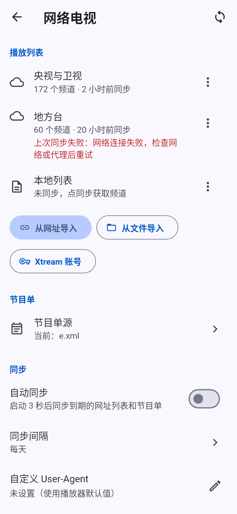
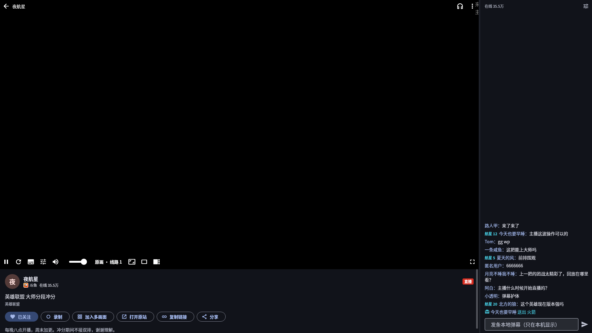
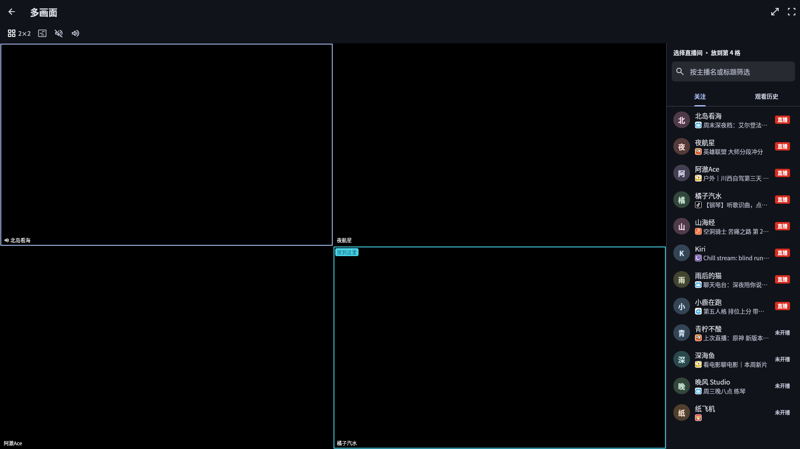
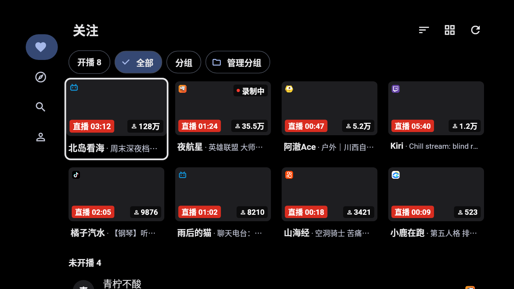
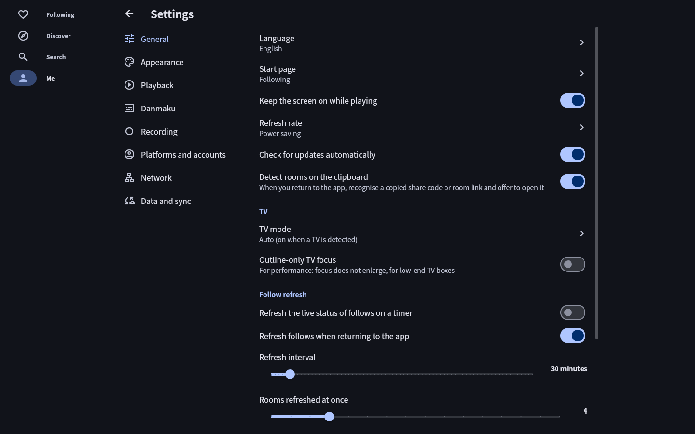

<h1 align="center">纯粹直播 v4（Pure Live）</h1>

<p align="center">开源的第三方多平台直播聚合播放器：一个应用看 33 个直播平台和网络电视，没有广告，不收集数据。</p>

<p align="center">
  <a href="https://github.com/wzgrx/pure_live/releases/latest"></a>
  <a href="LICENSE"></a>
  
</p>

> **现在能下载使用的是 3.2.11**，安装包在 [Releases](https://github.com/wzgrx/pure_live/releases/latest)。它是 3.x 的最后一个版本：3.x 已停止开发，全部精力放在 v4 上（[ADR 0014](docs/adr/0014-v4-first.md)）。v4 的功能代码已经全部写完，第一次构建也已完成，正在真机验证，预览版会发布在同一页面。3.x 的源码和说明在 [`legacy/`](legacy/README.md)，v4.0.0 发布时整个目录删除。

## 截图

以下截图由截图测试自动生成（[`apps/pure_live/test/screenshots/goldens`](apps/pure_live/test/screenshots/goldens)，数据是虚构的），界面改动后随测试一起更新。

<table>
  <tr>
    <td align="center"><br>关注：开播的在前，未开播的收成紧凑行</td>
    <td align="center"><br>发现：按平台浏览推荐和分区（深色）</td>
    <td align="center"><br>直播间：画面、弹幕、聊天栏</td>
  </tr>
  <tr>
    <td align="center"><br>搜索：跨平台搜主播，识别分享链接</td>
    <td align="center"><br>录制中心</td>
    <td align="center"><br>网络电视：M3U、Xtream、节目单</td>
  </tr>
</table>

<p align="center"><br>桌面：画面加常驻聊天栏，快捷键操作</p>
<p align="center"><br>多画面：最多 9 路同时看，选一路出声</p>
<p align="center"><br>电视：遥控器焦点、10 英尺界面、上下键换台</p>
<p align="center"><br>简体、繁体、英文三种界面语言，设置可以按名字搜索</p>

## 功能

**看直播**
- 统一用 mpv 播放。斗鱼等平台的播放地址会定时过期，v4 在后台续期并无缝拼接，不会断流；持续卡顿时自动降一档画质。
- 画质和线路随时切换；可以记住偏好的画质，按 Wi-Fi 和移动网络分别设置。
- 竖屏直播按竖屏全屏；手势调亮度和音量；竖屏全屏时上下滑切换直播间（可选），电视上下键换台，桌面 PageUp/PageDown。
- 仅听声音、定时关闭、助眠模式、锁定屏幕、剧场模式、应用内小窗、系统画中画、后台播放、系统媒体控制。
- 投屏到电视（DLNA）。

**弹幕**
- 21 个平台有实时弹幕，含醒目留言、礼物、粉丝牌；在画面上滚动，也可以在聊天栏里看。
- 屏蔽词、按用户屏蔽、相似弹幕合并，字号、透明度、速度和显示区域都能调；本地弹幕只在本机显示；画中画里也能开弹幕；可以下载免费字体用作弹幕字体。

**关注与发现**
- 跨平台关注，开播状态自动刷新，开播提醒，分组，多种排序（含自定义顺序），多选后批量加入多画面、设置分组、取消关注（可撤销）。
- 按平台浏览推荐和分区，常用分区可以收藏。
- 搜索：多个平台一起搜，按相关度、人数、粉丝排序；粘贴分享链接或口令直接打开直播间；没有搜索接口的平台用内置网页搜索兜底；有搜索历史。

**录制**
- 录制直播和弹幕，支持 FLV、HLS 和网络电视的连续 TS；断线自动重连并记录缺口，按时长或大小分段，崩溃后能恢复。
- 纯 Dart 转成 MP4，不需要 FFmpeg。Android 可以在后台录制，也可以预约录制网络电视节目。

**网络电视（IPTV）**
- 导入 M3U 播放列表、Xtream 账号和 XMLTV 节目单，支持回看和节目提醒。

**多画面**
- 手机最多 4 路，桌面最多 9 路；1×1、1×2、2×2、1+N、3×3 布局；只让一路出声，每路单独调音量。

**数据**
- 平台账号的 Cookie 用系统密钥加密保存；备份与恢复（能读 3.x 的备份），WebDAV、局域网同步；诊断包导出。

**各种设备**
- 手机、平板、桌面、电视按五个宽度等级分别排版；电视有完整的遥控器焦点体系。
- Windows 有单实例、托盘、开机自启和快捷键；便携版的数据放在程序目录的 `UserData` 里。

## 支持的平台

33 个直播平台加网络电视。“分区”指能按平台浏览推荐和分区；没有原生搜索的平台可以用网页搜索兜底；“仅链接”的平台只能粘贴链接打开。

| 平台 | 分区 | 搜索 | 弹幕 | 登录 | | 平台 | 分区 | 搜索 | 弹幕 | 登录 |
|---|:-:|:-:|:-:|:-:|---|---|:-:|:-:|:-:|:-:|
| 哔哩哔哩 | ✓ | ✓ | ✓ | ✓ | | PandaTV | ✓ | ✓ | ✓ |  |
| 斗鱼 | ✓ | ✓ | ✓ | ✓ | | 17LIVE | ✓ | ✓ | ✓ |  |
| 虎牙 | ✓ | ✓ | ✓ | ✓ | | LiveMe | ✓ | ✓ |  |  |
| 抖音 | ✓ | ✓ | ✓ | ✓ | | Steam 直播 | ✓ |  | ✓ |  |
| 快手 | ✓ | ✓ | ✓ | ✓ | | 六间房直播 | ✓ | ✓ |  |  |
| 网易CC | ✓ | ✓ |  |  | | 酷狗直播 | ✓ | ✓ |  |  |
| YY | ✓ | ✓ | ✓ | ✓ | | 京东直播 | ✓ |  |  |  |
| SOOP | ✓ | ✓ | ✓ | ✓ | | 百度直播 | ✓ |  |  |  |
| AcFun | ✓ | ✓ | ✓ |  | | LOOK 直播 | ✓ |  |  |  |
| Twitch | ✓ | ✓ | ✓ | ✓ | | 微博直播 | ✓ |  |  |  |
| CHZZK | ✓ | ✓ | ✓ |  | | niconico | ✓ | ✓ | ✓ |  |
| 猫耳 FM | ✓ | ✓ | ✓ |  | | 小红书 | 仅链接 |  |  |  |
| 克拉克拉 | ✓ | ✓ | ✓ |  | | YouTube Live | ✓ | ✓ | ✓ |  |
| 映客 | ✓ | ✓ |  |  | | TikTok LIVE | 仅链接 |  |  |  |
| Picarto | ✓ | ✓ | ✓ |  | | FC2 Live | ✓ |  | ✓ |  |
| TwitCasting | ✓ | ✓ | ✓ |  | | Bigo Live | ✓ |  |  |  |
| SHOWROOM | ✓ | ✓ | ✓ |  | | 网络电视 | ✓ | ✓ |  |  |

- 登录是可选的：登录后能看需要登录的直播和更高画质、弹幕里显示完整昵称（B 站扫码或网页登录，其它平台手动填 Cookie）。
- Bigo 的直播流是加扰的，由本地中继解扰后播放（[ADR 0033](docs/adr/0033-hls-relay.md)），按平台去留标准在观察期内。
- 3.x 已经下线的 Kick、花椒，关注和历史照常保留，打开时提示平台已下线。

## 和 3.x 相比

- **体积**：Android arm64 安装包从 144 MB 降到 54.5 MB（去掉 FFmpegKit、IJK 和重复的播放器与依赖）。
- **播放器只有一套**（mpv），各平台行为一致；租期续流和 HLS 中继让斗鱼、Bigo、niconico 等平台稳定播放。
- **错误说得清楚**：每个平台的错误都分类型（需要登录、被限流、风控、地区限制、接口变了……），界面说明原因并给出能做的操作。
- **界面重新设计**：四个一级入口，五个宽度等级分别排版，电视完整支持遥控器，三种界面语言，Material Symbols 图标。
- **质量保证**：478 个真实接口样本、各平台真实网络探针、93 张截图测试和全部单元测试，每次推送前都在本机跑完整门禁。
- 3.x 的关注、设置、分组、历史、录制任务都能从备份导入；设计取舍和每个决定的理由见 [`docs/adr/`](docs/adr/README.md)（36 份）。

## 进度

更新于 2026-09-28。**功能代码已全部写完，第一次构建完成；真机验证、预览版发布和 v4.0 切换还没做。**

| 阶段 | 状态 |
|---|---|
| 0 诊断与基线 | 完成 |
| 1 规格与样本 | 规格完成，33 个平台共 478 个接口样本；各规格里标“待确认”的项还没全部查证 |
| 2 设计方向与设计系统 | 完成：设计原则、令牌、组件库；独立复核的问题已全部修复（含图标换成 Material Symbols） |
| 3 工程底座 | 完成：workspace、本机门禁、工具链检查 |
| 4 平台与网络层 | 完成：首批 5 个平台的解析器、适配器和网络层 |
| 5 播放、弹幕、录制 | 代码完成，待真机验证：mpv 播放、HLS 中继、21 个平台的弹幕、FLV/HLS/IPTV 录制和转 MP4 |
| 6 新应用界面 | 代码完成，待真机验证：全部页面、三种语言、93 张截图测试；Android 和 Windows 第一次构建完成，Windows 实测能正常播放 |
| 7 其余平台、电视、桌面 | 代码完成，待真机验证：33 个平台加 IPTV 都已接入（Bigo 有条件保留），电视模式，Windows 外壳 |
| 8 对齐验收与切换到 v4.0 | 未开始 |

逐项进度见 [docs/rewrite/STATUS.md](docs/rewrite/STATUS.md)。

## 仓库结构

| 路径 | 内容 |
|---|---|
| [`apps/pure_live`](apps/pure_live) | v4 应用（预览版包名 `com.mystyle.purelive.next`） |
| [`packages/live_core`](packages/live_core) | 领域模型、类型化错误、33 个平台的解析器和适配器（纯 Dart） |
| [`packages/live_net`](packages/live_net) | 网络层：按平台的代理和 Cookie、节流、样本回放 |
| [`packages/live_media`](packages/live_media) | 播放会话与本地中继（FLV 续流拼接、HLS 中继），纯 Dart |
| [`packages/live_player`](packages/live_player) | 播放内核（media_kit / mpv）的 Flutter 绑定 |
| [`packages/live_danmaku`](packages/live_danmaku) | 各平台弹幕连接、过滤和合并 |
| [`packages/live_record`](packages/live_record) | 录制：FLV、HLS、IPTV 连续 TS，崩溃恢复，纯 Dart 转 MP4 |
| [`packages/live_iptv`](packages/live_iptv) | IPTV：播放列表、节目单、回看 |
| [`packages/live_store`](packages/live_store) | 存储（drift）、设置注册表、备份与 3.x 数据导入 |
| [`packages/live_cast`](packages/live_cast) | DLNA 投屏 |
| [`packages/live_ui`](packages/live_ui) | 设计系统：主题令牌、图标、尺寸等级、自适应导航、卡片、弹幕渲染、电视焦点 |
| [`tools/live_cli`](tools/live_cli) | 命令行工具：真实网络探针、接口样本录制、弹幕和续期检查 |
| [`tools/check_latest`](tools/check_latest) | 对比工具链和依赖与官方最新稳定版 |
| [`tools/gate`](tools/gate) | 门禁：格式、依赖方向、静态检查、测试 |
| [`spec/`](spec/constitution.md) | 行为规格：产品、各平台、各模块、回归清单、设计原则与令牌 |
| [`fixtures/`](fixtures/README.md) | 脱敏后的接口样本和播放器事件轨迹 |
| [`docs/rewrite/`](docs/rewrite/PLAN.md) | 重写方案、诊断、基线、进度 |
| [`docs/adr/`](docs/adr/README.md) | 架构决策记录 |
| [`third_party/`](third_party) | media_kit 自维护分支（[ADR 0002](docs/adr/0002-media-kit-fork.md)） |
| [`legacy/`](legacy/README.md) | 3.x 的归档：应用代码、发布工作流和维护规范，不再构建（[ADR 0016](docs/adr/0016-archive-v3.md)） |
| `assets/` | 只有 `version.json` 和 `releases.json`：已安装的 3.x 从这里检查更新 |
| [`toolchain.env`](toolchain.env) | Flutter、JDK、NDK、Gradle 等版本的唯一来源 |

## 开发

工具链版本以 [`toolchain.env`](toolchain.env) 为准（Flutter 3.47.5、JDK 27、NDK 30）。整个仓库是一个 pub workspace，`pubspec.lock` 只有根目录一份。

```bash
flutter pub get
```

```bash
bash tools/gate/gate.sh
```

```bash
dart run tools/live_cli/bin/live_cli.dart probe douyu 288016
```

`gate.sh` 只检查有改动的 v4 包；加 `--all` 检查全部 v4 包，每次推送前必须在本机跑通。构建和检查都在本机进行，GitHub Actions 只保留手动触发。

## 反馈

Issue 只受理 3.x 可以复现的问题。v4 的功能和界面以 [spec/](spec/constitution.md) 为准，发布预览版以后再开放反馈。

## 致谢与许可证

基于 [liuchuancong/pure_live](https://github.com/liuchuancong/pure_live)。许可证为 [AGPL-3.0](LICENSE)，许可证合规的处理见 [ADR 0006](docs/adr/0006-license-compliance.md)。安全问题见 [SECURITY.md](SECURITY.md)。
