<p align="center">
  
</p>

<h1 align="center">纯粹直播 Pure Live</h1>

<p align="center">
  一个应用看遍 34 个直播平台和网络电视。<br>
  弹幕、录制、多画面、小窗和后台播放，不用注册，没有广告，开源免费。
</p>

<p align="center">
  <a href="https://github.com/wzgrx/pure_live/releases/latest"></a>
  <a href="https://github.com/wzgrx/pure_live/releases"></a>
  <a href="LICENSE"></a>
</p>

<p align="center">
  <a href="https://github.com/wzgrx/pure_live/releases/latest"><b>下载 4.0.0</b></a>
  &nbsp;·&nbsp; <a href="docs/Y-发布和运营/Y03-发布说明和README/releases/v4.0.0.md">更新说明</a>
  &nbsp;·&nbsp; <a href="#功能详解">功能</a>
  &nbsp;·&nbsp; <a href="#支持的平台">支持的平台</a>
  &nbsp;·&nbsp; <a href="#从源码构建">从源码构建</a>
  &nbsp;·&nbsp; <a href="#路线图">路线图</a>
</p>

---

纯粹直播是一个第三方直播聚合应用：把哔哩哔哩、斗鱼、虎牙、抖音、快手等国内平台，和 Twitch、YouTube、SOOP 等海外平台的直播放进同一个应用里看，再加上你自己导入的网络电视（IPTV）频道。关注、弹幕、录制、多画面都在一处完成，不需要为每个平台各装一个 App。

**4.0 是一次整体重写。** 从网络层、平台适配、弹幕、播放、录制、存储到每一个界面都重新写过：功能以 3.x 为基础（只去掉了已停用的云账号，播放内核统一为 mpv），每个界面重新设计，3.x 的问题逐个修掉。这一版发布 **Android（手机和平板）**，可以直接覆盖安装 3.x，原来的关注、设置和历史都会保留。

## 亮点

<table>
  <tr>
    <td width="33%" valign="top">
      <b>34 个平台加网络电视</b><br>
      18 个国内平台、16 个海外平台，另有自己导入的 IPTV 频道和节目单，统一的关注、搜索和直播间。
    </td>
    <td width="33%" valign="top">
      <b>重新设计的直播间</b><br>
      竖屏、横屏全屏、竖屏直播流和平板分栏各自排版；加载、未开播、受限、断流都写清原因和下一步。
    </td>
    <td width="33%" valign="top">
      <b>28 个平台有弹幕</b><br>
      从 3.x 的 8 个增加到 28 个；飞行弹幕按时间计速，60 到 144 赫兹的屏幕上一样快，还能显示表情图片。
    </td>
  </tr>
  <tr>
    <td valign="top">
      <b>录制</b><br>
      一键录制或开播自动录，分段录制后合成 MP4，可同时保存弹幕；录制中心和通知栏随时看进度、随时停止。
    </td>
    <td valign="top">
      <b>多画面</b><br>
      四种布局同时看几路直播，点一下切换声音来源，每一格单独选清晰度、线路和音量。
    </td>
    <td valign="top">
      <b>小窗、画中画、后台播放</b><br>
      离开直播间时悬浮小窗继续播；系统画中画带暂停按钮；后台播放有媒体通知，还有纯音频和定时关闭。
    </td>
  </tr>
  <tr>
    <td valign="top">
      <b>流畅</b><br>
      只用 mpv 播放；播放时按视频帧率匹配屏幕刷新率；数据存进 SQLite，按行写入，不会写坏。
    </td>
    <td valign="top">
      <b>数据在你手里</b><br>
      不需要账号，没有广告和统计；Cookie 和密码用系统密钥库加密；备份、WebDAV、局域网设备同步都由你决定。
    </td>
    <td valign="top">
      <b>从 3.x 无缝升级</b><br>
      覆盖安装即可，首次启动自动导入关注、设置、历史、分组、屏蔽词、Cookie、录制任务和网络电视列表。
    </td>
  </tr>
</table>

## 截图

> 下面是 4.0 界面的设计效果图，应用按这些设计实现；图里的头像、封面、标题和弹幕都是示意内容。

### 直播间

<table>
  <tr>
    <td align="center" width="33%">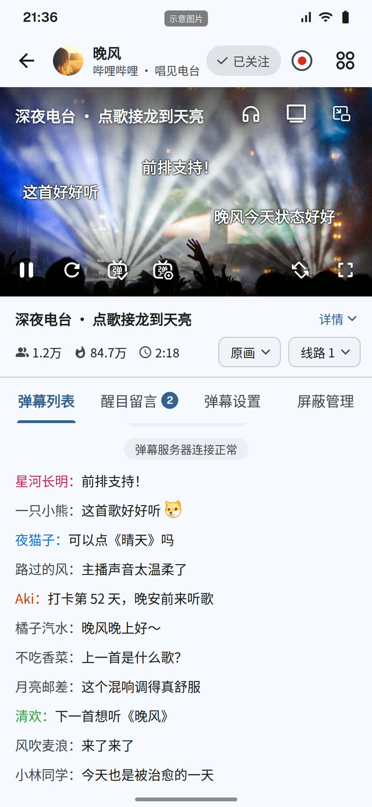<br><sub>竖屏：画面、信息行、弹幕列表和醒目留言</sub></td>
    <td align="center" width="33%"><br><sub>竖屏直播流：全屏观看，上滑恢复弹幕栏</sub></td>
    <td align="center" width="33%">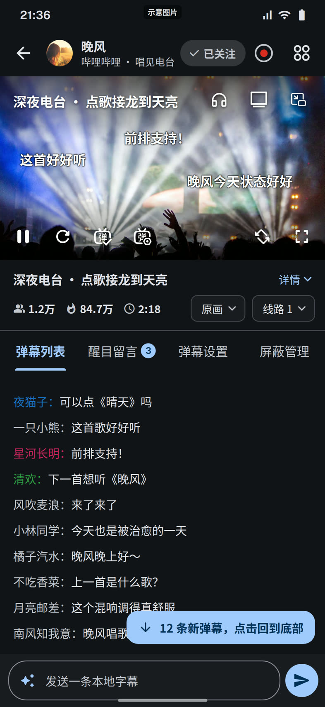<br><sub>深色模式：新弹幕提示、本地弹幕输入</sub></td>
  </tr>
  <tr>
    <td align="center" colspan="3">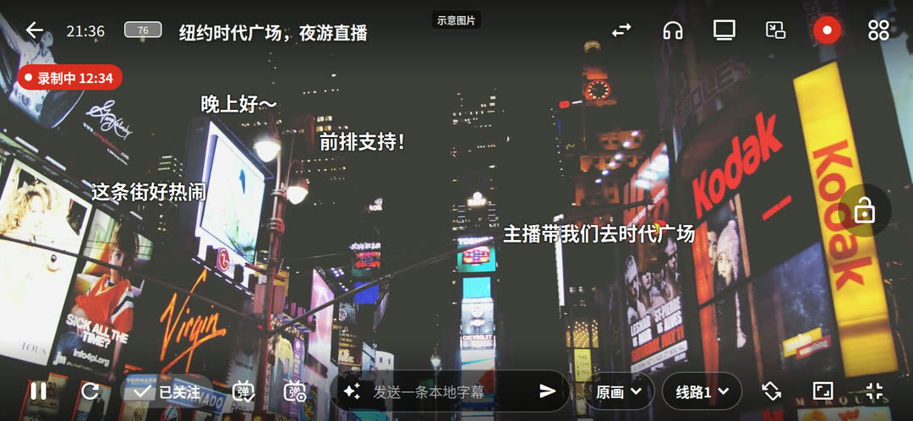<br><sub>横屏全屏：时间和电量、录制标记、锁定、本地弹幕、清晰度和线路</sub></td>
  </tr>
  <tr>
    <td align="center" colspan="3">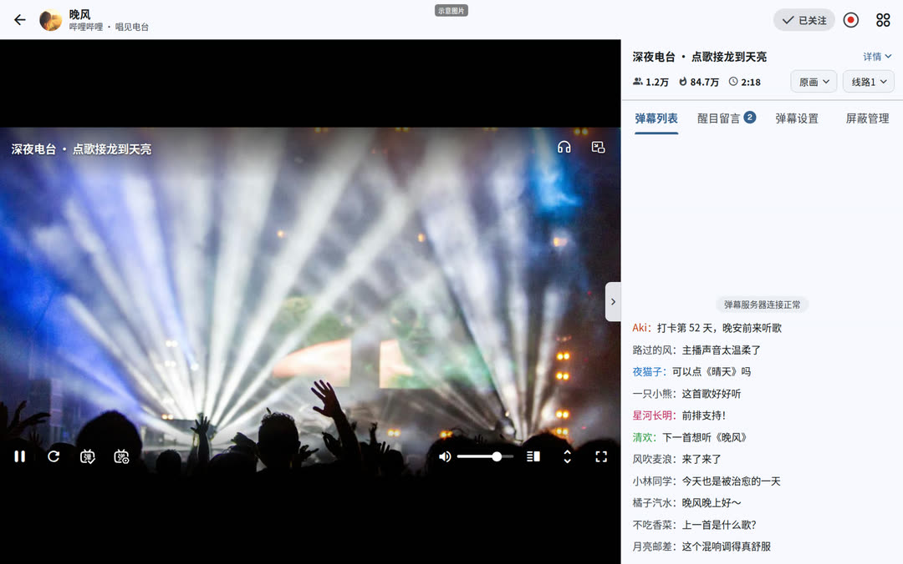<br><sub>平板和宽屏：画面加右侧聊天栏，聊天栏可以收起</sub></td>
  </tr>
</table>

### 弹幕和互动

<table>
  <tr>
    <td align="center" colspan="3"><br><sub>飞行弹幕：描边文字、彩色弹幕和表情图片</sub></td>
  </tr>
  <tr>
    <td align="center" width="33%">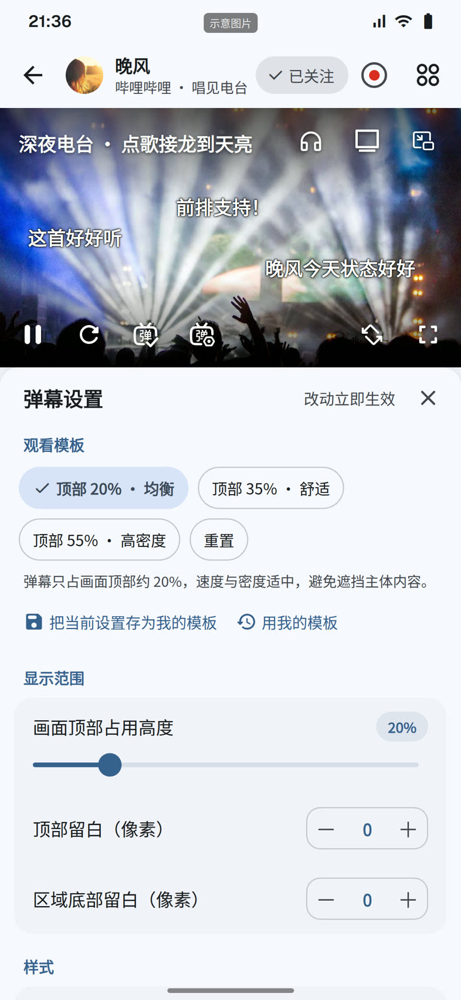<br><sub>弹幕设置：观看模板、显示范围、样式，改动立即生效</sub></td>
    <td align="center" width="33%">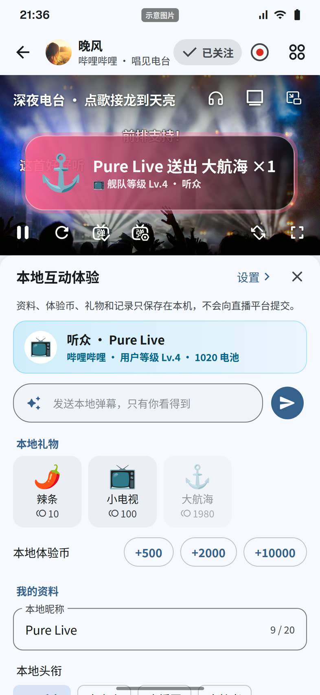<br><sub>本地互动：只有自己看得到的弹幕和礼物特效</sub></td>
    <td align="center" width="33%">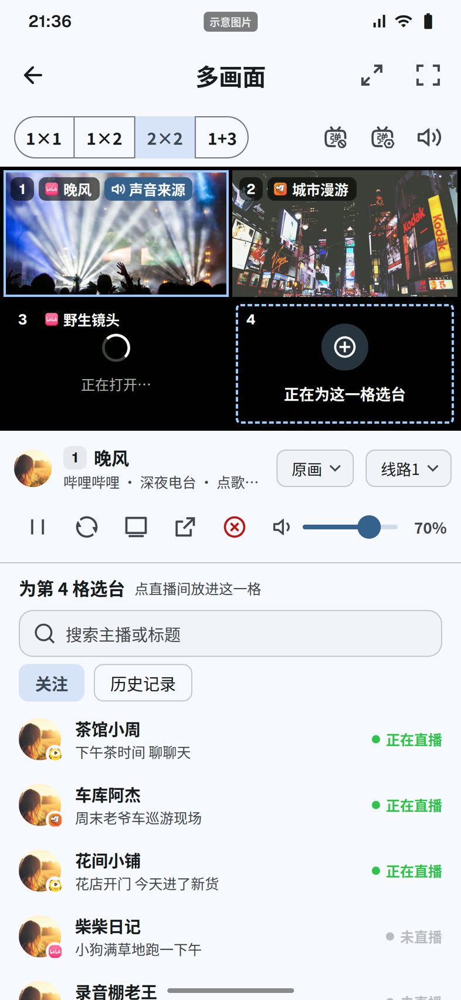<br><sub>多画面：2×2 布局，点格子切换声音来源</sub></td>
  </tr>
</table>

### 首页、分区和搜索

<table>
  <tr>
    <td align="center" width="33%"><br><sub>关注：已开播、录播、未开播三组，按平台筛选</sub></td>
    <td align="center" width="33%">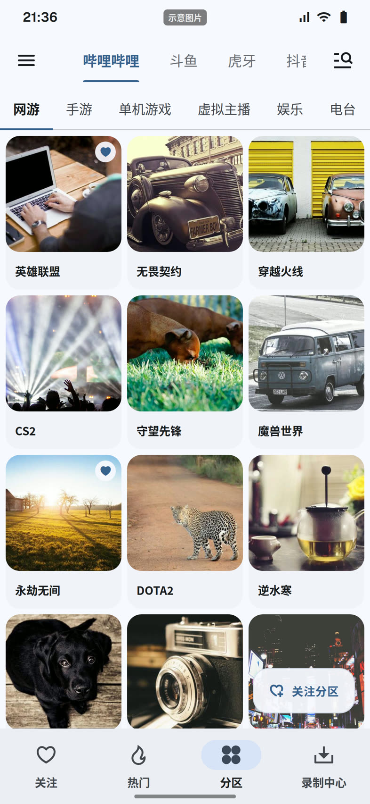<br><sub>分区：按平台和大类浏览，可关注分区</sub></td>
    <td align="center" width="33%"><br><sub>搜索：所有平台同时搜，结果标出平台</sub></td>
  </tr>
</table>

### 录制、网络电视和设置

<table>
  <tr>
    <td align="center" width="33%">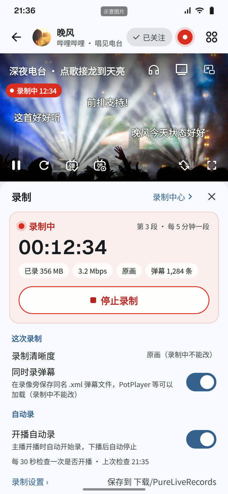<br><sub>直播间里的录制面板：计时、大小、码率、弹幕条数</sub></td>
    <td align="center" width="33%">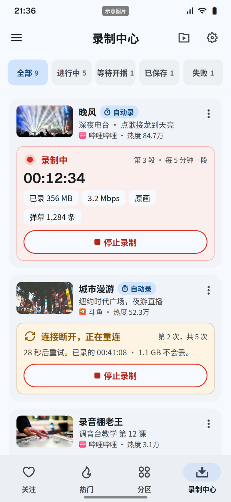<br><sub>录制中心：按状态筛选，断线自动重连</sub></td>
    <td align="center" width="33%">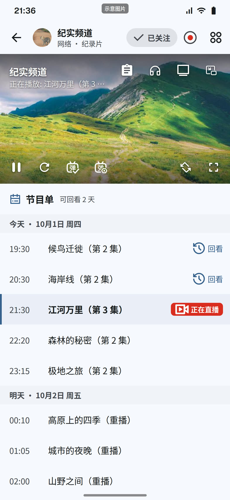<br><sub>网络电视：节目单、回看、返回直播</sub></td>
  </tr>
  <tr>
    <td align="center" colspan="3">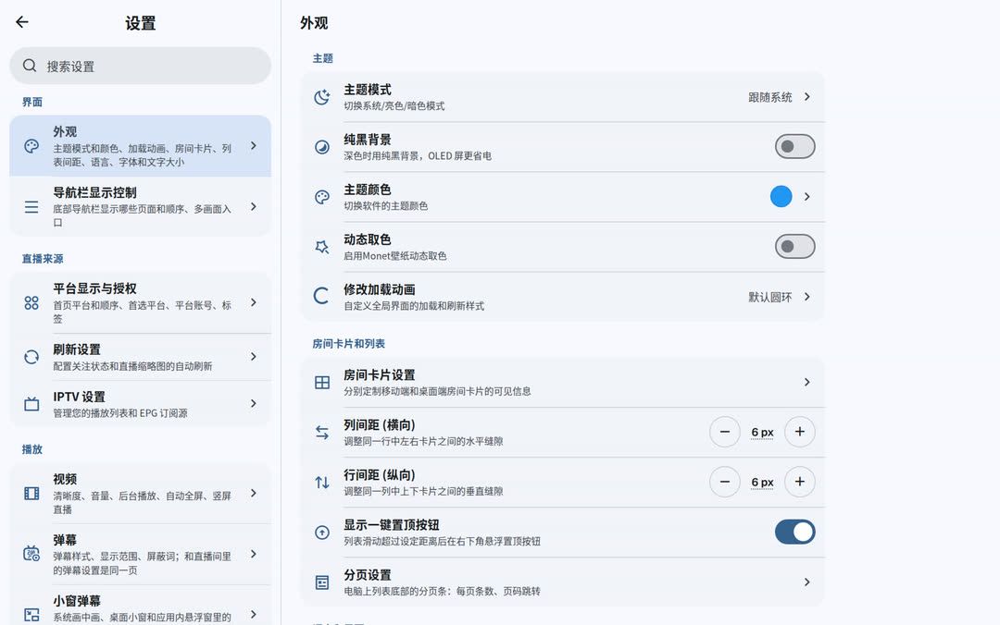<br><sub>设置：五组分类、按名字搜索，宽屏左右两栏</sub></td>
  </tr>
</table>

## 功能详解

### 看直播

- **三个入口**：关注、热门（按平台浏览推荐）、分区；平台的显示、顺序和首选平台可以自己调。
- **清晰度和线路**：WLAN 和移动数据分别设置默认清晰度；切换清晰度或线路时旧画面继续播，新画面接上再换过去。平台实际给的画质比选的低时，会如实告诉你。
- **自动恢复**：断流后自动重连，必要时刷新地址、换线路、改用软解；8 秒还没出画面会提示换一条线路。
- **状态写清楚**：未开播、封禁、轮播、需要登录、付费、地区限制、播放中断各有说明和对应的按钮。未开播的直播间每 60 秒检查一次，开播后自动开始播放。
- **手势**：单击显示控制层，双击全屏；左半屏上下滑调亮度，右半屏调音量；全屏时可以锁定，顶栏显示时间和电量。
- **竖屏直播流**：画面按比例加高，竖屏全屏有三档面板，上滑恢复弹幕栏；方向选择按直播间记住。
- **更多**：纯音频、自动助眠（进房即纯音频并定时停止）、定时关闭、按直播间记住音量、画面比例、屏幕常亮（可关）、投屏（DLNA）、获取直链、分享直播间、在平台 App 或浏览器打开；接外接键盘时可以用空格、方向键、R、F、Esc 操作。

### 弹幕

- **28 个平台**接入弹幕，弹幕列表跟随最新消息，往上翻时提示有多少条新弹幕；哔哩哔哩等平台的醒目留言单独一页，到时自动移除。
- **飞行弹幕**：显示区域、上下留白、透明度、速度、字号、粗细、描边、字体、帧率都能调，还有纯文字模式；三套观看模板一键切换，也能存成自己的模板。
- **表情**：支持表情的平台，弹幕列表和飞行弹幕里都显示表情图片。
- **过滤和屏蔽**：屏蔽关键词、屏蔽用户、合并重复弹幕、相似弹幕过滤，斗鱼还可以过滤疑似机器弹幕。
- **点按弹幕**：长按列表里的一条弹幕，或点按、长按画面上飞过的弹幕（在弹幕设置里打开），可以复制、屏蔽此用户、屏蔽关键词；面板打开时弹幕停住，关了继续。
- **跟着屏幕走**：速度按时间计算，60、90、120、144 赫兹的屏幕上一样快；视频暂停时弹幕也停。

### 本地互动

在直播间里发送只有自己看得到的本地弹幕，送本地礼物、看礼物特效，有体验币、等级和头衔。资料、体验币和记录只保存在本机，不会提交到任何直播平台。

### 录制

- **开始录制**：直播间里一键“立即录”，或者“开播自动录”：主播开播就开始，下播自动停止。可以选清晰度，同时把弹幕存成同名 `.xml` 文件（PotPlayer 等播放器可以加载）。
- **稳定**：用 FFmpeg 分段录制，结束后合成一个 MP4，合成时显示进度；断线自动重连、退避重试，已录的部分不会丢；应用重启后自动恢复任务。
- **录制中心**：全部、进行中、等待开播、已保存、失败五个筛选，各自带数量；已保存的可以直接播放、打开文件夹、再录一次；失败的可以看完整原因。
- **通知栏**：录制时常驻通知，显示主播和计时，可以直接“停止录制”或打开录制中心；被系统停掉时发通知说明，已录的部分照样保存。
- **存储**：自选录制目录，可以给录制文件设总大小上限，超出时自动删除最早的录像。

### 关注和开播状态

- 关注按已开播、录播、未开播分成三组，可以按平台和自建分组（标签）筛选，数量一目了然。
- 启动时先核验关注的开播状态，之后定时刷新、回到前台时刷新，再点一下“关注”也能刷新；同时刷新的数量有上限、单个超时会跳过，不会卡住整个列表。
- 想在主播开播时自动录下来，可以在直播间的录制面板里打开“开播自动录”。

### 搜索和分区

- 一次搜索所有平台，也可以只搜一个；可以选择包含未开播、按四种方式排序，按直播间或主播搜。
- 在搜索框粘贴直播间链接可以直接进入；复制了别人分享的直播间口令，回到应用时会提示打开（可以在设置里关掉）。从其他应用分享直播间链接给纯粹直播，也会直接打开。
- 搜索范围可以调整（例如只搜国内平台）；部分平台失败时温和提示，可以重试或继续用网页搜索——在应用内浏览器里打开平台页面，认出直播间后询问是否进入。
- 分区页按平台、大类浏览，分区可以关注，关注的分区有单独的列表。

### 多画面

1×1、1×2、2×2、1+3 四种布局，手机上最多 4 格。点格子切换声音来源，也可以全部静音；每格单独调音量、清晰度和线路，小格子自动省流量；从关注、历史或搜索里选台，各格都有弹幕，可以沉浸观看或全屏。

### 网络电视（IPTV）

- 从网络地址或本地文件导入 M3U、TXT 播放列表，导入 XML、GZ、JSON 节目单；可以按间隔自动同步，也能手动同步。
- 支持自定义 User-Agent 和频道请求头。
- 直播间里看节目单，可回看的节目点一下就回看，随时返回直播。
- 在别的应用里分享 M3U 文件，或用“打开方式”选纯粹直播，也能直接导入。

### 小窗和画中画

- **应用内小窗**：离开直播间时画面缩成悬浮小窗继续播，点小窗就能回到直播间，不用重新加载；小窗里的弹幕有单独的设置。
- **系统画中画**：在其他应用上方继续看，窗口里有暂停和播放按钮；可以打开“离开应用时自动画中画”。系统关掉了本应用的画中画时，会说明原因并直接打开对应的设置页。

### 后台播放

打开后台播放后，离开应用声音继续，通知栏有标题、主播、封面和暂停、停止按钮。第一次打开时会先说明，再申请通知权限和“忽略电池优化”。不开时，离开应用约 1.5 秒后自动暂停，回来接着播。

### 备份恢复、WebDAV 和设备同步

- **本地备份**：完整备份（设置、关注、历史、分组、屏蔽词和搜索记录，不含账号 Cookie 和 WebDAV 密码），或只导出关注列表；恢复前先预览会改变什么。3.x 导出的备份文件也能恢复。
- **WebDAV**：备份到自己的 WebDAV 服务器（例如坚果云），支持 Basic 和 Digest 认证，可以浏览、上传、恢复和删除。
- **设备同步**：两台设备在同一个局域网里扫码配对，互相发送或接收配置；能发现 3.x 的设备；同步账号 Cookie 需要手动打开，只建议在信任的设备之间使用。

### 账号登录

- 哔哩哔哩：扫码登录、网页（短信）登录或填写 Cookie。
- 斗鱼（自动续期）、虎牙、抖音、快手、YY、Twitch、SOOP：填写 Cookie。
- 登录后可以拿到更高画质，看需要登录的直播间（以平台的规定为准）。登录是可选的，不登录也能正常看。

### 外观和个性化

主题模式（跟随系统、浅色、深色）、纯黑背景、主题颜色和动态取色；五档字号和下载字体；85 种加载动画；房间卡片显示哪些信息、行列间距；底部导航显示哪些页面和顺序；简体中文和 English 两种界面语言。设置分成界面、直播来源、播放、通用和网络、数据五组，可以按名字搜索设置项。

### 隐私

- 不需要注册账号；本项目不收集任何数据，没有广告，也没有接入统计或崩溃上报服务。
- 关注、历史、设置都保存在本机；Cookie、WebDAV 密码用 Android Keystore 加密保存，备份文件里不含这两样。
- 应用直接和各直播平台通信。检查更新时读取本仓库在 GitHub 上的版本文件（启动时检查可以关掉），下载安装包时从 GitHub 或国内加速镜像下载；下载字体时访问 GitHub 上的字体仓库。
- 应用代理和播放代理分开设置：平台请求、弹幕、图片走应用代理，直播流走播放代理。

## 设计和性能

4.0 的每个界面都按同一套原则设计：

- **3.x 的习惯不丢**：入口、手势、快捷键和设置项都保留，3.x 的设置和数据照旧生效；改变外观或操作的地方，都是逐条对比、确认过的。
- **同一件事只有一种做法**：一个动作一个图标、一个组件、一套文字；手机、平板用同一套组件，屏幕大小只决定放在哪里。
- **状态写全**：加载、空、出错、受限、离线、权限被拒、进行中、完成，都用统一的样子说明原因和下一步。
- **跟着窗口走**：布局按页面自己的可用宽度排，旋转、分屏、折叠屏开合时跟着变；房间网格的列数按宽度计算。

性能上的做法：

- **只用 mpv 播放**（自己维护的 media_kit 分支，libmpv 0.41.0、FFmpeg 9.0.2）；切换清晰度和线路不重建播放器。
- **刷新率**：保留 3.x 的省电、均衡、性能三档；播放时按视频帧率选择屏幕刷新率，只在能无缝切换时切换。
- **弹幕**：排版缓存成图，帧率取屏幕刷新率的整数分之一，同屏数量有上限；只描边、不加模糊阴影。
- **界面**：状态变化只重建用到它的部分，列表懒加载，图片按显示尺寸解码、缓存有上限；视频上方不用模糊效果。
- **存储**：SQLite（drift）按行写入、有事务，读写放在后台线程。

## 支持的平台

一共 **34 个直播平台**，另加 **网络电视（IPTV）**。“搜索”一列写的是这个平台能搜到什么：

- **含未开播**：能搜到正在直播和没在直播的直播间；**直播中**：只能搜到正在直播的；
- **主播**：还可以按主播搜；**按房间号**、**按频道**：平台没有关键词搜索，只能输入房间号或频道名查找；**推荐内筛选**：在平台推荐的直播里按关键词筛选。

### 国内平台（18 个）

| 平台 | 播放 | 弹幕 | 搜索 | 分区 | 登录 |
|---|:---:|:---:|---|:---:|---|
| 哔哩哔哩 | 支持 | 支持 | 含未开播、主播 | 支持 | 扫码、网页、Cookie |
| 斗鱼 | 支持 | 支持 | 含未开播、主播 | 支持 | Cookie（自动续期） |
| 虎牙 | 支持 | 支持 | 直播中、主播 | 支持 | Cookie |
| 抖音 | 支持 | 支持 | 直播中 | 支持 | Cookie |
| 快手 | 支持 | 支持 | 含未开播、主播 | 支持 | Cookie |
| YY | 支持 | 支持 | 直播中、主播 | 支持 | Cookie |
| 网易CC | 支持 | — | 含未开播、主播 | 支持 | — |
| AcFun 直播 | 支持 | 支持 | 含未开播、主播 | 支持 | — |
| 猫耳 FM | 支持 | 支持 | 含未开播 | 支持 | — |
| 映客 | 支持 | — | 推荐内筛选 | 支持 | — |
| 克拉克拉 | 支持 | 支持 | 含未开播 | 支持 | — |
| 小红书 | 支持 | — | 按房间号 | — | — |
| 微博直播 | 支持 | — | 按房间号 | 支持 | — |
| 京东直播 | 支持 | 支持 | 含未开播 | 支持 | — |
| 酷狗直播 | 支持 | 支持 | 含未开播 | 支持 | — |
| 百度直播 | 支持 | 支持 | 按房间号 | 支持 | — |
| 六间房直播 | 支持 | 支持 | 含未开播 | 支持 | — |
| LOOK 直播 | 支持 | 支持 | 按房间号 | 支持 | — |

### 海外平台（16 个）

在中国大陆访问海外平台一般需要代理，可以在“设置 → 自定义网络代理”里设置。

| 平台 | 播放 | 弹幕 | 搜索 | 分区 | 登录 |
|---|:---:|:---:|---|:---:|---|
| Twitch | 支持 | 支持 | 含未开播 | 支持 | Cookie |
| SOOP | 支持 | 支持 | 直播中 | 支持 | Cookie |
| YouTube Live | 支持 | 支持 | 直播中 | — | — |
| TikTok LIVE | 支持 | — | 按频道 | — | — |
| Kick | 支持 | 支持 | 含未开播 | 支持 | — |
| niconico | 支持 | 支持 | 直播中 | 支持 | — |
| SHOWROOM | 支持 | 支持 | 直播中 | 支持 | — |
| TwitCasting | 支持 | 支持 | 直播中 | 支持 | — |
| CHZZK | 支持 | 支持 | 含未开播 | 支持 | — |
| PandaTV | 支持 | 支持 | 含未开播 | 支持 | — |
| Picarto | 支持 | 支持 | 含未开播 | 支持 | — |
| Bigo Live | 支持 | 支持 | 推荐内筛选 | 支持 | — |
| LiveMe | 支持 | — | 含未开播 | — | — |
| FC2 Live | 支持 | 支持 | 含未开播 | 支持 | — |
| Steam Broadcasts | 支持 | 支持 | 含未开播 | 支持 | — |
| 17LIVE | 支持 | 支持 | 直播中 | 支持 | — |

### 网络电视

| 来源 | 播放 | 弹幕 | 搜索 | 分区 | 登录 |
|---|:---:|:---:|---|:---:|---|
| 网络电视（IPTV） | 支持 | — | 本机频道 | 按播放列表分组 | — |

说明：没有弹幕的几个平台，是平台不提供公开的聊天接口，或者需要登录、签名才能接入；小红书和微博直播只能关注某一场直播，不能按主播关注。平台接口时常变化，遇到打不开的请到 [Issues](https://github.com/wzgrx/pure_live/issues) 反馈。

## 下载和安装

### 系统要求

Android 8.0 及以上的手机和平板。

### 选择安装包

到 [Releases](https://github.com/wzgrx/pure_live/releases/latest) 下载 APK，文件名里带有 CPU 架构：

| 架构 | 适合的设备 |
|---|---|
| **arm64-v8a** | 近几年的绝大多数手机和平板，**不确定就选它** |
| armeabi-v7a | 较老的 32 位设备；arm64-v8a 装不上时再试这个 |
| x86_64 | 电脑上的安卓模拟器、少数 x86 平板 |

安装时如果系统提示“安装未知应用”，在弹出的设置里允许当前的浏览器或文件管理器即可。

### 从 3.x 升级

- **直接覆盖安装，不要先卸载**：卸载会连同 3.x 的数据一起删掉。
- 第一次打开 4.0 时自动导入 3.x 的设置、关注（含关注的分区）、观看历史、分组、屏蔽词、账号 Cookie、WebDAV 设置、录制任务和网络电视列表。导入只读取 3.x 的文件，不修改、不删除。
- 保险起见，升级前可以在 3.x 的“备份与恢复”里做一次完整备份；4.0 可以直接恢复 3.x 的备份文件。
- 3.x 的云账号登录已经停用，配置可以改用 WebDAV 或设备同步在设备之间转移。

## 从源码构建

需要 Linux 或 Windows 上的 Flutter 环境。工具链的版本统一写在 [`toolchain.env`](toolchain.env)（Flutter 3.47.5、Dart 3.13.4、JDK 27、Android SDK 37.2、build-tools 37.0.0、NDK 30.0.16248370），升级时只改这一处。

```bash
git clone https://github.com/wzgrx/pure_live.git
cd pure_live

# 1. 环境：按 toolchain.env 装好工具链，写一个环境脚本，每次构建前 source 一下
#    （下面是示例路径，换成你自己的）
export FLUTTER_ROOT="$HOME/tools/flutter-sdk/3.47.5"
export JAVA_HOME="$HOME/tools/jdk-27"
export ANDROID_HOME="$HOME/Android/Sdk"
export PATH="$FLUTTER_ROOT/bin:$JAVA_HOME/bin:$ANDROID_HOME/platform-tools:$PATH"

# 2. 录制用的 FFmpeg 原生包：下载一次后缓存在 ~/.cache/pure_live/ffmpeg_kit，之后离线也能构建
bash tools/ffmpeg_kit/fetch.sh android

# 3. 依赖：仓库是 pub workspace，所有包共用根目录的 pubspec.lock
flutter pub get

# 4. 按 CPU 架构分别打包
cd apps/pure_live
flutter build apk --release --split-per-abi
```

- 产物在 `apps/pure_live/build/app/outputs/flutter-apk/`，每个架构一个 APK。播放用的 libmpv 原生包由构建自动从本仓库 Releases 下载。
- 签名密钥不在仓库里：没有 `apps/pure_live/android/key.properties` 时，release 包用调试密钥签名。
- debug 和 profile 包的包名带 `.v4dev`、应用名是“纯粹直播 v4dev”，和正式版互不影响，适合开发调试。
- 提交前跑门禁：`bash tools/gate/gate.sh --all`，依次检查格式、包之间的依赖方向、`dart analyze` 和全部测试，输出 `gate: passed` 才算通过。开发中改了哪个包，只跑 `bash tools/gate/gate.sh` 即可。

## 项目结构

内核是纯 Dart 包，可以单独测试；Flutter 只出现在播放绑定、界面组件和应用里。依赖只能从上往下，由门禁检查。

```text
apps/pure_live          Flutter 应用：页面、路由、Android 原生部分（Windows、电视外壳的代码也在这里，暂未发布）
packages/live_ui        主题、图标和通用组件
packages/live_player    基于 media_kit（mpv）的播放器绑定
packages/live_media     取流管线、本地中继、播放恢复
packages/live_record    录制：FFmpeg 分段、合并、断线续录、弹幕 XML
packages/live_danmaku   各平台的弹幕连接、解码和过滤
packages/live_iptv      网络电视：播放列表、节目单的解析和同步
packages/live_cast      DLNA 投屏
packages/live_store     存储（drift + SQLite）、设置、备份、3.x 数据迁移
packages/live_core      数据模型、平台接口和 34 个平台的适配器
packages/live_net       HTTP、WebSocket、代理和 Brotli 解码
packages/live_vod       哔哩哔哩点播和音乐的核心（给电视版用，暂未发布）
third_party/            自己维护的 media_kit 分支
tools/                  门禁、工具链检查、FFmpeg 原生包、效果图工具
docs/                   开发计划、模块记录、界面设计和功能清点
```

开发计划和进度见 [docs/PLAN.md](docs/PLAN.md)，界面设计见 [docs/README.md/](docs/specs/UI.md)，功能清点见 [docs/README.md/](docs/inventory/FEATURES.md)。

## 路线图

4.0 先把 Android 做扎实，其余客户端按这个顺序跟进，用的是同一套界面设计：

| 客户端 | 现状 | 计划 |
|---|---|---|
| **Android 手机和平板** | 4.0.0 正式版 | 补齐余下的小功能（见[更新说明](docs/Y-发布和运营/Y03-发布说明和README/releases/v4.0.0.md)的“以后要做的”），持续修平台变化 |
| **Windows** | 界面已按同一套设计做好，包括自绘标题栏、托盘、关闭时的选择、桌面小窗置顶 | 补上 Windows 专属的功能（开机启动、单实例、在新窗口打开直播间等），然后发布 Windows 版 |
| **Linux** | 和 Windows 共用桌面界面 | 在 Windows 之后 |
| **电视（Android TV）** | 遥控器操作的电视界面已经设计好；电视外壳、焦点导航、直播浏览和基本直播间已有代码 | 补全电视直播间、网络电视、设置，以及哔哩哔哩点播和音乐 |
| **iOS、iPadOS、macOS** | 平台差异（安全区、滑动返回、系统画中画、菜单栏、Cmd 快捷键）已经设计好 | 需要 Mac 构建，以后再做 |

## 反馈和参与

- 遇到问题或有建议，请到 [Issues](https://github.com/wzgrx/pure_live/issues) 反馈。报告播放问题时请写上平台、直播间链接、清晰度和线路，以及“设置 → 日志管理”里导出的日志。
- 欢迎提交 Pull Request。改动请先跑通门禁；代码规范是 very_good_analysis、行宽 120，公开接口写文档注释。

## 开源许可

本项目以 [GNU Affero General Public License v3.0（AGPL-3.0）](LICENSE) 发布。你可以自由地使用、学习、修改和分发；如果分发修改后的版本，或者把修改后的版本作为网络服务提供给别人使用，需要以同样的许可证公开完整的源代码，并保留原有的版权和许可声明。本软件不附带任何担保。

应用用到的第三方组件按各自的许可证使用，可以在应用的“关于”页查看。

## 免责声明

- 纯粹直播只是一个播放工具，本身不提供任何直播内容，也不在任何服务器上存储或转发直播内容。直播画面、弹幕、封面等内容的版权归各直播平台和主播所有。
- 录制下来的内容只保存在你自己的设备上，请仅用于个人观看，尊重主播和平台的版权。
- 本项目只用于学习和技术交流。请遵守你所在地区的法律法规和各平台的用户协议，不要用于侵犯他人权益的用途。
- 各平台的名称和商标归其所有者所有，本项目与这些平台没有任何关联。
