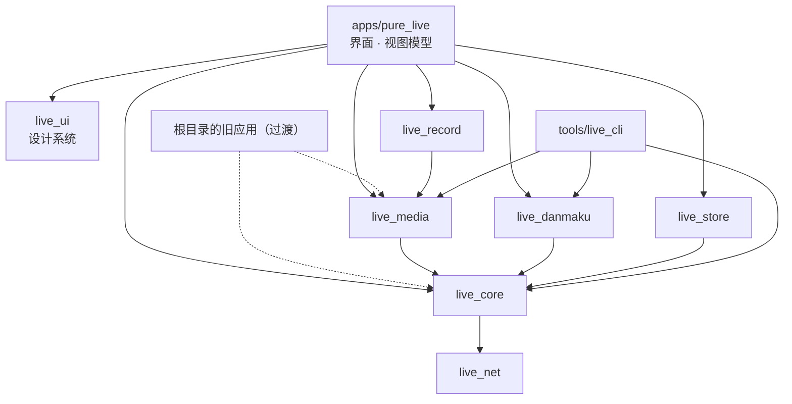
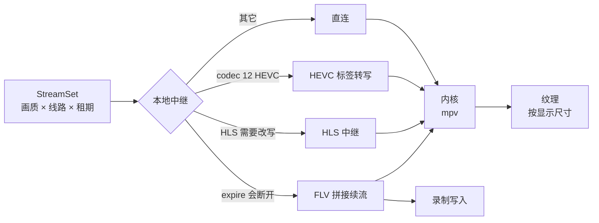
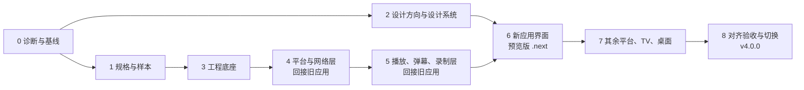

# 纯粹直播 v4 重构方案

> **状态**：已批准（2026-09-27）。12 项决定全部采用推荐值，之后的技术选择由 Claude 决定并记录在 `docs/adr/`。进度见 [STATUS.md](STATUS.md)。
>
> **依据**：`master@9bbaf11b`（v3.2.11）；工具链和依赖版本为 2026-09-27 从官方渠道实时查询。

从 v3.2.11 出发，在原仓库 `master` 上分阶段重写全部代码：架构、界面、布局、美术、操作逻辑、多尺寸适配、性能和工程体系一并重做。工具链和依赖一律用官方最新稳定版。旧版在重写期间继续发布，每一步都能验证、能回退。

## 01 结论与关键决定

能重写的全部重写，但不做“一次性推倒重来”。几千个提交积累下来的平台契约和踩坑经验，先整理成规格和回归样本；新代码以它们为验收标准，逐块替换旧代码，最后删除旧实现，发布 v4.0.0。

| 方面 | 决定（推荐） | 理由 |
|----|----|----|
| 仓库与分支 | 原仓库、只用 `master`；改成 Dart pub workspace，旧应用留在根目录作为 workspace 根，新应用在 `apps/pure_live`（ADR 0007） | 保留 stars、issues、发布记录和应用内更新地址；底层包可以先接回旧应用，边重写边发布 |
| 替换方式 | 底层（平台接口、网络、播放中继、弹幕协议、存储）先抽成独立包，旧应用改为依赖它们；界面层在新应用里整体重做，功能对齐后一次切换 | 底层可以逐个开关验证；界面两套并存的成本太高 |
| 技术栈 | Flutter 3.47.5 / Dart 3.13.4、Riverpod 3、go_router 18、drift 2.35、dio 5 + 原生网络栈、libmpv（自编 FFmpeg 9） | 全部为官方最新稳定版；去掉内置的 GetX |
| 播放内核 | 全平台只用 mpv；去掉 IJK、Exo 和 fvp（libmdk 是专有库，见 ADR 0006） | 一个 APK 里有三份独立的 FFmpeg 库（合计约 49 MB），libmpv 内还静态链接了一份 |
| 录制 | 复用播放的本地中继直写 FLV/TS，转封装共用一份 FFmpeg；去掉 FFmpegKit（29 MB） | 录制也能无缝续流，不再每 5 分钟切一段 |
| 界面 | 重新设计信息架构、布局、视觉、美术和操作逻辑；先出设计系统和页面稿，自审和独立复核后再写代码 | 界面层整体重写，这时改设计几乎不增加成本 |
| 适配 | 按窗口尺寸等级（紧凑 / 中等 / 展开 / 大 / 超大）设计布局，TV 用方向键焦点模型单独设计 | 手机、平板、折叠屏、桌面窗口、电视用同一套代码 |
| 性能 | 先测基线，再设预算，预算写进 CI 门禁 | “极致优化”必须能量化 |
| 验收 | 每个模块：单元测试 + 录制的真实接口样本 + 真实网络探针 + 关键路径真机 | \#35 的教训：单元测试全过，真机仍然失效 |

**已确认**：[第 17 节](#17-已确认的决定)的 12 项决定于 2026-09-27 全部采用推荐值；之后的技术选择由 Claude 决定，并记录在 `docs/adr/`。

## 02 现状诊断

以下数据来自对 master@9bbaf11b 的统计和 v3.2.11 安装包的拆解。

| 项目 | 规模 | 问题 |
|----|----|----|
| 业务代码 `lib/` | 763 文件 / 18.3 万行 | `lib/core` 6.1 万、`lib/modules` 5.2 万；平台接口、界面和播放逻辑互相引用 |
| 最大文件 | player_manager.dart 5028 行 | 播放、恢复、续期、画中画、Windows 热切换都在一个类里 |
| 内置 GetX | lib/get 1.6 万行 | 状态、路由、依赖注入混在一起，难以测试和替换 |
| 测试 | 469 文件 / 9.9 万行 | 大量绑定旧的内部结构（控制器替身等），换架构后无法复用；需要转成行为样本 |
| 文档 | 565 份 / 3.4 万行 | 过多，对 AI 协作反而是干扰；新体系只保留规格、架构决策记录和操作手册 |
| 依赖 | 约 150 个 | 明显冗余：3 个加载动画库、2 个模糊匹配库、3 个图标库、2 个悬浮窗库、3 套播放器；Syncfusion 需要商业或社区许可 |
| 平台适配器 | 33 个 + IPTV | 接口经常变，没有统一的错误分类和健康监测 |
| 网络 | dart:io | Windows 上不跟随系统代理；TLS 指纹容易被 Cloudflare 拦截（Kick 因此下线） |
| 签名 | 调试证书 1e832295… | 正式发布用的是调试签名，存在安全隐患，也无法上架应用商店 |

### 安装包构成（arm64，144 MB）

| 组成部分              | 大小    | FFmpeg 副本 |
|-----------------------|---------|-------------|
| libffmpegkit（录制）  | 29.1 MB | 是          |
| libapp（Dart 代码）   | 22.4 MB |             |
| libmpv（内含 FFmpeg） | 21.6 MB | 是          |
| IJK 播放器            | 12.7 MB | 是          |
| libflutter            | 11.2 MB |             |
| 表情图片 assets/emo   | 10.6 MB |             |
| fvp（mdk + FFmpeg）   | 10.1 MB | 是          |
| classes.dex           | 8.1 MB  |             |
| ML Kit 扫码模型       | 4.7 MB  |             |
| 其它                  | 13.5 MB |             |

解压后大小。FFmpeg 共四份：录制、IJK、fvp 各一份，libmpv 内静态链接一份。

### 必须继承的经验（回归清单的种子）

这些都是真实踩过的坑，重写时每一条都要变成新代码里的测试：

- 斗鱼匿名原画 `expire=300`，CDN 在第 300 秒断开；两条链接时间戳同一时间线，可按关键帧无缝拼接。
- media_kit 在流结束时先发 `playing=false` 再发 `completed=true`；测试替身必须按真实顺序发事件。
- 虎牙签名 FLV 的凭据过期后，已打开的连接仍可继续播放，不能按“到期即断”处理。
- Shopee、17LIVE 的 FLV 使用旧式 codec 12 HEVC，FFmpeg 8 之前不认识。
- Android 17 访问局域网代理需要本地网络权限；targetSdk 37 起没有这个权限会全部失败。
- Windows 下 `dart:io` 不跟随系统代理；海外站点在 Clash 出口 IP 轮换时会因为链接绑定 IP 而被拒。
- Windows 纹理在退出时的释放顺序、Android 首帧黑屏的防护（StableVideoLayer）。
- 小窗的拖动手势层会吞掉上层菜单的点击。
- 竖屏直播的全屏逻辑、点击收起控制栏。
- 多画面：卡顿恢复要保留手动选择的线路；恢复次数按时间窗口限制，而不是一辈子只能恢复两次。
- Linux 的 libmpv 依赖 VA-API 等库；系统库优先、自带库兜底。
- Kick 等站点对 `dart:io` 的 TLS 指纹返回 403。

## 03 重构原则

写进 `spec/constitution.md`，所有会话和子代理都必须遵守；能自动检查的做成 hooks 和 CI 门禁。

1.  **行为以规格为准**：`spec/` 是唯一依据。实现和规格冲突时，先改规格、说明原因，再改代码。
2.  **能重写就重写**：旧代码只作参考，不复制粘贴；新代码只从规格和样本出发。
3.  **官方最新稳定版**：工具链和依赖只用官方最新稳定版（不用 beta/dev），精确锁定版本，每周自动检查升级；落后于最新版的依赖必须写明原因和计划。
4.  **每一步都可验证**：完成标准必须是能运行的检查——测试、真实网络探针、截图对比、性能测量或真机记录。
5.  **每一步都可回退**：底层包通过开关接入旧应用；新应用用单独的包名并行安装，直到切换。
6.  **性能有预算**：启动、首帧、帧耗时、内存、包体都有上限，超出即 CI 失败。
7.  **依赖方向单向**：界面 → 功能 → 数据 → 平台接口；`live_core` 只能是纯 Dart。
8.  **隐私默认安全**：Cookie 加密存储；不默认上报任何数据；局域网功能必须配对确认。
9.  **只有 master**：小步提交、每个验证过的改动都推送；版本号只随正式发布修改。
10. **Android + Windows 优先**：其它平台的能力保留，但不作为每一步的验收条件。
11. **许可证**：项目保持 AGPL-3.0。发行物不得包含专有组件、GPL-2.0-only 或许可证不明的代码；每个发布附带原生库的对应源码（ADR 0006）。

## 04 工具链与依赖基线

2026-09-27 从官方渠道查询（Flutter 发布清单、services.gradle.org、Google Maven、Android SDK 仓库、Adoptium、pub.dev、GitHub Releases）。

### 工具链

| 工具 | 当前 | 目标（最新稳定） | 说明 |
|----|----|----|----|
| Flutter / Dart | 3.47.5 / 3.13.4 | 3.47.5 / 3.13.4 | 已是最新稳定；3.49 仍在 beta，不用。3.47 起桌面默认使用 Impeller |
| Gradle | 9.8.0 | 9.8.0 | 已最新；9.8 支持在 JDK 27 上运行 |
| Android Gradle Plugin | 9.4.1 | 9.4.1 | 已最新；插件改用内置 Kotlin 支持 |
| Kotlin | 随 AGP | 2.4.20 | 显式锁定到最新版 |
| JDK | Temurin 26.0.2.1 | Temurin 27 | 27 是最新特性版（LTS 为 25）；按“最新”原则用 27，Gradle 支持 28 后再升 |
| Android NDK | 27.3.13750724 | 30.0.16248370 | libmpv 等原生库用 NDK 30 重新编译 |
| compileSdk / targetSdk | 37 / 37 | 37（平台 37.2） | build-tools 37.0.0 |
| minSdk | 26 | 26（待定） | 见第 17 节；影响签名密钥轮换 |
| Windows 编译器 | MSVC 19.52 预览版 | Visual Studio 最新正式版 | 构建机当前用的是预览版编译器，不符合“最新稳定”原则 |
| mpv / FFmpeg | 0.41.0 / 9.0.2 | 最新正式版 | Android、Linux 已自编（0.41.0 + FFmpeg 9.0.2）；Windows 目前是 Predidit 预编译的开发版（0.41.0-1049 + FFmpeg master），改为按正式版标签自编；全平台共享一份 FFmpeg |

### 核心依赖

| 用途 | 选用 | 最新版（pub.dev） | 处理 |
|----|----|----|----|
| 状态与依赖注入 | flutter_riverpod + riverpod_annotation / generator / lint | 3.4.3 / 4.0.7 / 4.0.9 / 3.1.9 | 【替换 GetX】 |
| 路由 | go_router（类型安全路由） | 18.0.1 | 【替换 GetX 路由】 |
| 数据库 | drift + sqlite3 | 2.35.0 / 3.6.0 | 【扩大使用】关注、历史、录制、IPTV |
| 旧数据读取 | hive_ce | 2.20.0 | 【仅迁移用】 |
| 网络 | dio + native_dio_adapter（Android 用 cronet_http，Apple 用 cupertino_http） | 5.11.1 / 1.8.0 / 1.9.0 / 3.1.0 | 【重写】原生栈自动跟随系统代理，支持 HTTP/3 |
| 模型与序列化 | freezed + json_serializable + build_runner | 4.0.2 / 6.14.1 / 2.16.1 | 【新增】 |
| 多语言 | slang + slang_flutter | 4.19.2 / 4.19.0 | 【替换 easy_localization】类型安全 |
| 播放 | media_kit（基于 Predidit/media-kit 的自维护分支） | pub 1.2.6（2025-12） | 【保留】已同步到上游最新提交 803c4a27，见下方说明 |
| 弹幕渲染 | canvas_danmaku（参考）或自研画布渲染 | 0.3.3 | 【替换 flame_barrage】 |
| 图片 | extended_image 或 cached_network_image | 10.1.0 / 4.0.2 | 【二选一】必须支持按显示尺寸解码 |
| TV 焦点 | dpad | 3.0.0 | 【评估】或基于官方 Focus 体系自研 |
| 桌面窗口 | window_manager | 0.5.2 | 【保留】 |
| 后台播放 | audio_service | 0.18.19 | 【保留】 |
| 弹幕协议 | protobuf、web_socket_channel | 6.1.0 / 3.0.3 | 【保留】 |
| 网页登录 | flutter_inappwebview | 6.1.5（2024-10） | 【隔离】超过一年未发版，项目实际用的是第三方 6.2.0-beta.3 分支（违反“不用 beta”）；封装在接口后面，评估替代 |
| 主题 | dynamic_color、flex_color_scheme（可选） | 2.1.0 / 9.0.0 | 【按设计定】 |
| 日志 | talker_flutter | 5.1.20 | 【替换 logger】本地日志与导出 |
| 崩溃上报 | sentry_flutter（可选，默认关闭） | 9.30.1 | 【待定】 |
| 静态检查 | very_good_analysis | 11.0.0 | 【替换 flutter_lints】 |
| 测试 | mocktail、alchemist（截图测试）、patrol（真机集成测试）、widgetbook（组件目录） | 1.0.5 / 0.14.0 / 4.10.0 / 3.25.0 | 【新增】 |

### media_kit 自维护分支

media_kit 不使用 pub.dev 上的版本，而是基于 <a href="https://github.com/Predidit/media-kit" target="_blank" rel="noopener">Predidit/media-kit</a> 的自维护分支。2026-09-27 已同步到该仓库当日最新提交 `803c4a27`（安全处理 mpv 暂不可用的属性）。与本地补丁重叠的两个文件做了三方合并，没有冲突，本地补丁逐行不变。

|  | pub.dev 最新版 | 官方仓库 main | Predidit main（我们的上游） |
|----|----|----|----|
| 最近更新 | 2025-12（1.2.6 / video 2.0.1） | 2026-08-30，未发版 | 2026-09-26 |
| 原生库分发 | `media_kit_libs_*` 预编译包 | 同左 | Native Assets，按 `native_bundles.json` 下载并校验 |
| 能否换成自编 libmpv | 不能单独替换某个平台 | 同左 | 可以，改清单即可 |
| Windows 渲染 | 原版 | 原版 | 三缓冲、无卡顿管线、ARM64 |

我们在上游之上的补丁：Android 三个架构和 Linux 使用自编 mpv 0.41.0 + FFmpeg 9.0.2；`setVideoOutputEnabled`（纯音频模式不重开流、Android Surface 统一管理）；Windows `frameRevision` 画面进度信号（多画面卡顿恢复、渲染器重建）；`setSize(force:)`；Windows 退出时的渲染释放顺序；去掉 `hls_ad_filter`。换成 pub.dev 版会编译失败并丢失这些能力，解码能力也会倒退。

**策略**：对这类依赖，“官方最新”指“所选活跃上游的最新提交”，而不是 pub.dev 版本号。`check_latest` 对比上游仓库的提交；每次同步按 `third_party/media_kit_video/PURELIVE_PATCH.md` 的步骤三方合并，并登记在 `docs/DEPENDENCY_AUDIT.md`。

### 依赖瘦身

| 现有 | 处理 |
|----|----|
| flutter_spinkit、loading_animation_widget、loading_indicator | 【删除】设计系统自带一个加载动画 |
| string_similarity、fuzzywuzzy | 【合并】保留一个或自写 |
| font_awesome_flutter、remixicon | 【删除】统一用 Material Symbols 可变图标字体 |
| floating、flutter_floating | 【合并】小窗和画中画统一实现 |
| better_player_plus、IJK | 【删除】内核只保留 mpv |
| ffmpeg_kit_extended_flutter | 【删除】录制改走本地中继 |
| syncfusion_flutter_sliders | 【删除】商业许可；用 Material Slider |
| firebase_core / auth / cloud_firestore | 【待定】国内经常无法访问；建议由 WebDAV 和局域网同步替代 |
| mobile_scanner（含 4.7 MB 模型） | 【评估】换成体积更小的扫码方案 |
| easy_refresh、waterfall_flow、scrollview_observer 等 | 【评估】能用官方 Sliver 实现的都去掉 |
| animated_splash_plus | 【删除】用系统启动页 API |
| rxdart、logger、easy_localization、equatable | 【删除】由 Riverpod、talker、slang、freezed 替代 |

### “始终最新”的机制

- **锁定**：`pubspec.lock`、Gradle 版本目录、`.fvmrc` 全部精确版本；CI 与本地使用同一套工具链。
- **检查**：新增 `tool/check_latest`，从上面列出的官方渠道查询最新稳定版，与锁定版本比较。每周在 CI 跑一次，落后时自动开升级提交。
- **升级门禁**：升级提交必须通过全部测试、探针、截图和性能门禁才能合入 `master`。
- **例外登记**：自维护分支（media_kit、libmpv）和暂时不能升级的依赖，写进 `docs/adr/`，注明原因和复查日期。

## 05 目标架构

参考 dart_simple_live（平台接口独立成纯 Dart 包）、Flutter 官方架构指南（视图 → 视图模型 → 仓库 → 服务）、LocalSend 和 Mangayomi（Riverpod + 多包仓库）。

### 仓库结构

```text
pure_live/                     ← pub workspace 根，同时是旧应用（只有 master 分支，ADR 0007）
  lib/ android/ windows/ …     旧应用：逐步改为依赖下面的包；第 8 阶段删除
  apps/
    pure_live/                 新应用：界面与视图模型（手机、平板、桌面、TV）
  packages/
    live_core/                 纯 Dart：33 个平台适配器、模型、签名、错误分类
    live_net/                  网络：原生栈适配、代理策略、Cookie、限流、重试
    live_danmaku/              弹幕：各平台协议解码（在后台 isolate）、统一消息、过滤
    live_media/                播放：内核抽象、本地中继（续流、HLS、HEVC 转写）、资源调度
    live_record/               录制：中继直写、分段、转封装、续期
    live_store/                存储：drift 数据库、设置、加密 Cookie、旧数据迁移、备份格式
    live_ui/                   设计系统：主题变量、组件、图标、动效
  tools/
    live_cli/                  命令行：探针、样本录制、接口巡检（dart run live_cli probe douyu 5526219）
    check_latest/              官方最新版本检查
  spec/                        规格：product、constitution、sites/*、modules/*、design/*、regressions
  docs/adr/                    架构决策记录
  third_party/                 media_kit 自维护分支；libmpv 与 FFmpeg 构建配方
```

### 依赖方向



`live_core`、`live_net`、`live_danmaku` 不依赖 Flutter，可以用 `dart test` 快速测试，也能被命令行探针直接调用。依赖方向用 lint 规则检查。

### 平台适配器接口

按能力拆分，每个平台只实现自己支持的部分；结果和错误都是明确的类型：

```dart
abstract interface class LiveSite {
  SiteId get id;
  SiteCapabilities get capabilities;        // 目录、搜索、弹幕、登录、录制提示…
}
abstract interface class CatalogSource    { Future<Page<RoomCard>> recommend(PageCursor c); ... }
abstract interface class SearchSource     { Future<Page<RoomCard>> search(String q, PageCursor c); }
abstract interface class RoomSource       { Future<RoomDetail> detail(RoomRef r); }
abstract interface class StreamSource     { Future<StreamSet> streams(RoomDetail d, QualityChoice q); }
abstract interface class DanmakuSource    { DanmakuConnector connector(RoomDetail d); }

sealed class SiteFailure { }                 // 离线 / 需要登录 / 地区限制 / 被限流 / 风控 / 接口变更 / 网络
final class StreamSet {                       // 画质 × 线路，每条带租期
  final List<StreamLine> lines;              // url、headers、lease(refreshAt, cutsConnection)
}
```

- **租期是数据的一部分**：链接自带“何时刷新、到期是否断开连接”，播放和录制都按它决定续流方式（斗鱼拼接、虎牙只预取）。
- **错误分类统一**：界面只根据错误类型显示文案和重试方式，不再解析错误字符串。
- **样本驱动**：每个平台都有录制下来的真实接口响应（脱敏），解析测试离线运行；探针定期对比线上接口，发现接口变更。
- **规则热更新（后期可选）**：参考 KazumiRules 和 Mangayomi 的扩展仓库，把简单平台的接口地址、字段映射做成签名的规则包，不发版也能修复。复杂的签名算法仍然编译在应用里。

### 界面层

- 每个页面一个视图（Widget）和一个视图模型（Riverpod Notifier）；视图只做展示和转发操作。
- 仓库（Repository）负责缓存、重试、合并多个数据源；服务（Service）只包装外部接口，不保存状态。
- go_router 类型安全路由；分享链接、深链接、TV 启动、画中画都走同一套路由。
- Riverpod 的 `select` 精确订阅，避免播放页整页重建。

## 06 播放、弹幕与录制

### 播放管线



- **内核抽象**：统一的 `PlayerEngine` 接口，事件顺序按真实库定义并写进契约测试；全平台只用 mpv（fvp 因许可证移除，见 ADR 0006）；Android 的兜底是 mpv 自身的软解回退和 mediacodec 兼容模式。
- **拆开 5028 行的 PlayerManager**：分成会话（打开 / 关闭）、恢复策略（按错误类型和时间窗口）、续期（交给中继）、画中画和小窗、Windows 热切换，各自独立测试。
- **起播更快**：解析和连接并行；首屏先用可用的最快线路；支持低延迟模式（mpv 缓存参数按平台调优）。
- **多画面资源调度**：每格按实际显示尺寸解码和渲染；小格自动降画质；不可见的格子暂停解码；硬件解码不足时按优先级降级。
- **一份 FFmpeg**：libmpv 改为动态链接共享的 FFmpeg，录制转封装复用同一份，去掉 FFmpegKit 和 IJK。

### 弹幕

- **解码**：各平台协议（WebSocket、protobuf、brotli/zlib 解压）放在后台 isolate，主线程只接收统一的消息结构。
- **过滤**：屏蔽词、重复合并、疑似机器人过滤、按密度抽样，都在后台完成。
- **渲染**：画布直绘（参考 canvas_danmaku：滚动和固定弹幕分层、没有弹幕时停止绘制），文字排版结果缓存复用；每帧设上限，超出就降密度，不掉帧。
- **交互**：弹幕列表、醒目留言、礼物用普通组件显示，和画面上的弹幕分开。

### 录制

- 直接写入中继输出的 FLV/TS，拼接续流让录制文件没有缺口；结束后按需转封装为 MP4。
- 分段按时间或大小；异常退出可恢复；录制和观看共用一条上游连接（可选）。
- 聊天记录与视频同步保存（已有功能沿用规格）。

## 07 信息架构与操作逻辑

### 导航结构

| 一级入口 | 内容 | 变化 |
|----|----|----|
| 关注 | 开播 / 全部 / 分组；一键多画面 | 支持分组和排序；开播提醒 |
| 发现 | 热门 + 分区，按平台切换 | 热门和分区合并为一个入口 |
| 搜索 | 跨平台搜索主播和直播间；粘贴链接直接打开 | “链接解析”并入搜索 |
| 我的 | 历史、录制中心、多画面、设置、备份与同步 | 设置按“播放 / 弹幕 / 网络 / 外观 / 数据 / 关于”重组 |

### 手机手势

| 操作 | 行为 |
|----|----|
| 单击画面 | 显示 / 隐藏控制层（沿用 3.2.10 的行为） |
| 双击画面 | 横屏源进入横屏全屏；竖屏源进入竖屏全屏；再次双击退出 |
| 左侧上下滑 / 右侧上下滑 | 亮度 / 音量 |
| 双指缩放 | 画面比例：适应 → 填充 → 裁切 |
| 长按画面 | 快捷面板：画质、线路、弹幕开关、截图、定时关闭 |
| 竖屏沉浸模式上下滑 | 切换到关注列表中的上一个 / 下一个开播直播间（新增，可在设置里关闭） |
| 返回键 | 依次：收起面板 → 退出全屏 → 缩小为小窗（可设置）→ 离开直播间 |
| 长按直播间卡片 | 静音小窗预览；抬起后可选择“进入 / 加入多画面 / 关注”（新增） |

### 桌面键盘与鼠标

| 按键 | 行为 | 按键 | 行为 |
|----|----|----|----|
| <span class="kbd">Space</span> | 暂停 / 继续 | <span class="kbd">F</span> / <span class="kbd">Esc</span> | 全屏 / 退出全屏 |
| <span class="kbd">M</span> | 静音 | <span class="kbd">↑</span> <span class="kbd">↓</span> | 音量 |
| <span class="kbd">D</span> | 弹幕开关 | <span class="kbd">Q</span> / <span class="kbd">L</span> | 画质 / 线路菜单 |
| <span class="kbd">P</span> | 小窗 / 画中画 | <span class="kbd">Ctrl</span>+<span class="kbd">F</span> | 搜索 |
| <span class="kbd">1</span>–<span class="kbd">4</span> | 多画面切换声音焦点 | <span class="kbd">Ctrl</span>+<span class="kbd">R</span> | 刷新直播间 |

鼠标悬停显示控制层并在静止 2 秒后隐藏；滚轮在画面上调音量；横向标签支持滚轮和拖动；右键菜单提供常用操作；按 <span class="kbd">?</span> 显示快捷键帮助。

### TV 遥控器

| 按键 | 浏览界面 | 全屏播放 |
|----|----|----|
| 方向键 | 在卡片网格中移动焦点，行列记忆上次位置 | 上 / 下：切换同列表上一个 / 下一个直播间（像换台）；左 / 右：呼出侧栏（弹幕、画质线路） |
| 确认 | 进入直播间 | 显示 / 隐藏控制层 |
| 菜单 | 页面选项 | 播放设置 |
| 返回 | 返回上一级 | 收起侧栏 → 退出到列表 |

### 一致性规则

- 同一个操作在所有设备上叫同一个名字、放在同一个相对位置。
- 所有可点的元素都能用键盘和遥控器聚焦，焦点状态清晰可见。
- 破坏性操作（清空历史、删除录制）有确认，并提供撤销。
- 改变旧有操作习惯的地方，首次使用时给出一次性提示，并写进更新说明。

## 08 多尺寸动态适配

按可用窗口宽度（而不是设备类型）分级，窗口大小变化时实时切换布局；高度单独分级，用于横屏手机等矮窗口。

| 宽度等级 | 可用宽度（dp） | 典型设备                        |
|----------|----------------|---------------------------------|
| 紧凑     | \< 600         | 手机竖屏（约 393）              |
| 中等     | 600–839        | 手机横屏（约 860）、小平板      |
| 展开     | 840–1199       | TV（960）、平板竖屏             |
| 大       | 1200–1599      | 平板横屏（约 1280）、小桌面窗口 |
| 超大     | ≥ 1600         | 桌面窗口（1440–2560）           |

| 页面 | 紧凑 | 中等 | 展开 | 大 / 超大 |
|----|----|----|----|----|
| 导航 | 底部导航栏 | 导航轨 | 展开的导航轨 | 固定侧边栏 |
| 首页网格 | 2 列 | 3 列 | 4 列 | 按卡片最小宽度自动 5–7 列 |
| 直播间 | 画面在上、弹幕列表在下；横屏自动全屏 | 画面在上，弹幕列表可折叠 | 画面 + 右侧弹幕栏 | 剧场模式：大画面 + 可拖动宽度的侧栏 |
| 多画面 | 1×2 竖排 | 2×2 | 2×2 / 1+3 | 2×2 / 1+3 / 3×3，可自由调整 |
| 搜索 | 单列结果 | 两列 | 列表 + 详情 | 列表 + 详情 + 平台筛选侧栏 |
| 设置 | 分级页面 | 分级页面 | 左侧分类 + 右侧内容 | 同左，内容区限制可读宽度 |

- **实现**：`live_ui` 提供 `WindowClass` 和自适应骨架组件；页面只描述各等级下的布局，切换时保留滚动位置和播放状态，不重建播放器。
- **折叠屏和分屏**：识别铰链区域，画面和弹幕分在两侧；分屏和自由窗口下按实际窗口尺寸布局。
- **TV 模式**：检测 Android TV 自动进入，也可以手动切换；按 10 英尺距离放大字号和焦点框，所有操作都能用方向键完成。
- **安全区与刘海**：全屏播放时画面可以延伸到刘海区域，控制层避开；Android 15 起强制全面屏（edge-to-edge）。
- **桌面窗口**：设置最小窗口尺寸；窗口大小和位置记忆；多显示器下按显示器的缩放比例渲染。
- **验证**：每个页面在五个宽度等级、两个高度等级下截图测试，再在真机和不同窗口尺寸下录屏检查。

## 09 视觉系统与美术

先定方向，再做设计系统和页面稿，自审通过后才写代码。具体风格由 Claude 在第 2 阶段调研后确定并记录，这里先给框架。

#### 设计原则

- 内容优先：画面和主播最显眼，界面元素退后
- 一只手够得着常用操作
- 各设备一致，但不生硬拉伸
- 快：界面动效不拖慢操作

#### 颜色

- 浅色、深色、纯黑三套主题
- Android 12 起可选跟随系统取色
- 语义色（直播中、错误、成功）与品牌色分开
- 所有文字对比度满足 WCAG AA

#### 字体

- 中文用系统字体：Android 系统字体、Windows 微软雅黑 UI，明确回退顺序
- 数字用等宽数字（人数、码率、时长）
- 可选下载式品牌字体（先核对许可证）
- 字号跟随系统缩放，大字号下布局不错位

#### 间距、圆角、层级、动效

- 4 点网格：4 / 8 / 12 / 16 / 24 / 32 / 48
- 圆角分 4 级，按组件角色使用
- 动效 100 / 200 / 300 ms 三档，遵循系统“减少动态效果”

### 组件清单

直播间卡片（含开播、人数、平台标识）、播放器控制层、弹幕面板、画质和线路选择、底部弹层、对话框、标签栏、导航骨架、搜索框、空状态、错误状态、加载骨架屏、Toast、焦点框（TV）。每个组件都有实时预览、使用规范，以及浅色、深色、大字号三种截图测试。

### 美术

| 资源 | 要求 |
|----|----|
| 应用图标与品牌标识 | 重新设计；Android 自适应图标 + 13 起的单色主题图标；Windows 多尺寸 ICO；TV 横幅 320×180 |
| 启动页 | 使用 Android 12 系统启动页 API，冷启动不额外等待 |
| 空状态 / 错误插画 | 矢量（SVG），一套统一风格，深浅色都能用 |
| 图标 | 统一为 Material Symbols 可变图标，粗细和填充随状态变化 |
| 平台 logo | 各平台商标，原样使用，不重绘 |
| 表情图片（现 10.6 MB） | 改为 WebP 并按平台按需下载 |

### 设计交付流程

1.  调研同类应用和平台规范，确定方向，写 `spec/design/principles.md`（附理由）。
2.  做设计系统页面：各主题颜色、字体字号、间距圆角、组件实时预览和规范。
3.  在设计画布上画关键页面：首页、直播间（竖屏 / 横屏 / 桌面）、多画面、搜索、设置、TV 首页，每页含加载、空、出错三种状态。
4.  对照设计原则自审并由独立子代理复核后，实现为 `live_ui` 组件库，用 widgetbook 做组件目录，用截图测试防止走样。

## 10 性能极致优化

先测量旧版的基线（第 0 阶段），再定预算。下表是初始目标，基线出来后校准，然后写进 CI 门禁。

| 指标 | 测量方式 | 初始目标 |
|----|----|----|
| 冷启动到首帧 | `adb shell am start -W`、`--trace-startup` | 中端机 ≤ 旧版的 60% |
| 首页可交互（有缓存） | 集成测试打点 | ≤ 1 秒 |
| 点击直播间到画面出现 | 集成测试 + 播放器首帧事件，固定网络环境 | ≤ 旧版的 70% |
| 滚动帧耗时 | `traceAction` 时间线汇总 | 120 Hz 设备构建和光栅化 P90 ≤ 8 ms，掉帧率 \< 1% |
| 弹幕高密度 | 回放录制的弹幕流（每秒 200 条） | 不掉帧；主线程占用 ≤ 3 ms/帧 |
| 内存 | `dumpsys meminfo`、DevTools | 单直播间和 4 格多画面各设上限；连续进出 50 个直播间无增长 |
| 安装包（arm64） | CI 统计 | 144 MB → 去掉 FFmpegKit 和 IJK 后约 102 MB；其余优化后目标 80 MB 以内 |
| 耗电与发热 | 30 分钟连续播放记录 | 比旧版低；静止画面时降低刷新率 |

### 手段

#### 启动

- 只初始化首页需要的服务，其余延迟加载
- 数据库和设置异步打开，启动路径上没有同步磁盘读写
- 平台适配器按需创建
- 首页先显示缓存，再刷新

#### 渲染

- Impeller（3.47 起全平台默认）；Windows 上需验证已知的性能问题
- 视频、弹幕、控制层各自隔离重绘（RepaintBoundary）
- 视频上方避免半透明图层和圆角裁剪
- Riverpod `select` 精确订阅，控制层淡入淡出不重建画面

#### 列表与图片

- 全部用 builder / Sliver，固定卡片高度
- 封面按显示尺寸解码，限制图片缓存大小
- 滚动方向预取下一屏
- 骨架屏代替转圈

#### 网络

- Android 用 Cronet：HTTP/2 和 HTTP/3、连接复用、跟随系统代理
- 请求可取消、按平台限流、带抖动的退避重试
- 大 JSON 在后台 isolate 解析
- 目录和详情做短时缓存

#### 视频

- 优先硬件解码；纹理尺寸跟随显示尺寸
- 多画面：小格降画质、不可见的格子暂停
- 低延迟模式按平台调参
- 后台只保留音频

#### 体积

- 一份 FFmpeg；按 ABI 分包
- 去掉重复依赖和图标字体
- 表情按需下载
- 代码瘦身后 libapp 预计明显变小

### 门禁

在 K90 上每晚跑一次性能套件（启动、滚动、弹幕、多画面、内存），结果保存为 JSON 并与上次比较；任何指标变差超过 10% 就让 CI 失败，附上时间线文件。

## 11 各平台细节

#### Android（手机、平板、折叠屏）

- 预测性返回手势；全面屏；16 KB 页面对齐
- 画中画、后台音频、通知栏和锁屏控制、耳机线控
- Android 17 本地网络权限；按应用选择语言
- 单色主题图标；分享进入、链接打开

#### Android TV

- Leanback 启动器入口和横幅
- 全部操作可用方向键完成
- 低端盒子：Impeller 回退路径、解码能力检测、默认较低画质
- armeabi-v7a 包（很多盒子是 32 位）

#### Windows

- Impeller 默认开启，验证视频纹理路径的性能
- 系统代理（WinINet 设置）自动跟随
- 系统媒体控制（SMTC）和媒体键；托盘；多窗口
- 按显示器缩放；深色标题栏；安装包和便携版；代码签名证书

#### Linux / macOS / iOS（后续）

- 代码保持可编译，不作为每一步的验收条件
- Linux 的 libmpv 系统库优先、自带库兜底（已实现）
- Apple 平台走 CI 构建

## 12 你可能没考虑到的

| 事项 | 为什么重要 | 建议 |
|----|----|----|
| 正式签名 | 现在发布的 APK 用调试证书签名，任何人都能用同一证书签出“更新”；也无法上架应用商店 | 换正式密钥，用 APK 签名 v3 的密钥轮换保证覆盖安装：Android 13 起完全支持，9–12 需实测，8 需要重装 |
| 预览版并行安装 | 新应用测试期间不能影响正式版用户 | 预览版使用包名后缀 `.next`，可与正式版同时安装 |
| 旧数据迁移 | 关注、历史、设置、Cookie 丢了用户就流失 | 首次启动自动从旧 Hive 数据迁移，保留备份，失败可回退；迁移过程写进测试 |
| 许可证合规 | 项目是 AGPL-3.0；fvp 的 libmdk、Syncfusion、ML Kit、GMS 是专有组件；FFmpeg 以 LGPLv3 构建，发布时必须附对应源码 | 移除专有组件；每个发布附原生库源码包；CI 检查许可证；应用内自动生成开源许可页（ADR 0006） |
| 供应链安全 | 依赖和构建产物被篡改的风险 | GitHub Actions 按提交哈希固定；发布产物附带构建来源证明和 SBOM；依赖审查 |
| 隐私 | 各平台登录 Cookie 属于敏感信息 | Android Keystore / Windows DPAPI 加密存储；备份时默认不含 Cookie；不默认上报任何数据 |
| 平台健康巡检 | 平台接口常常悄悄变更，用户先发现 | CI 每天用 `live_cli` 探测所有平台，生成状态 JSON；应用里可以显示“某平台当前异常” |
| 网络与代理 | 海外平台受出口 IP 轮换影响；Windows 不跟随系统代理 | 原生网络栈跟随系统代理；按平台设置代理规则；检测到链接绑定 IP 时提示固定节点；可选 DoH |
| 风控 | 请求过快、设备标识不一致会被封 | 按平台限流；每个平台保持固定的设备标识和 Cookie |
| 可观测性 | 用户反馈的问题难以复现 | 本地滚动日志 + 一键导出脱敏诊断包；可选崩溃上报（默认关闭） |
| 无障碍 | 读屏用户、大字号用户、键盘用户 | 所有控件有语义标签；支持系统字号缩放；焦点顺序合理 |
| 多语言 | 现有英文翻译不完整 | slang 类型安全；简体、繁体、英文；缺失的翻译在 CI 报错 |
| 备份格式 | WebDAV、局域网同步、本地导出格式各不相同 | 统一带版本号的备份格式，向后兼容 |
| 离线与弱网 | 地铁、电梯等场景 | 缓存首页和关注；弱网时自动选低画质；明确的离线提示 |
| 文档瘦身 | 565 份文档对人和 AI 都是负担 | 新体系只保留规格、架构决策记录、操作手册；旧文档归档 |
| 发布流水线 | 现在大部分构建靠本机手动 | CI 全自动构建、签名、生成更新说明、上传并核对哈希；本机构建只作备份 |
| 测试设备矩阵 | 只在 K90 上测不够 | 至少覆盖：Android 8 旧机、中端机、K90、平板或折叠屏、TV 盒子、Windows 10 和 11 |
| Windows 代码签名 | 未签名的安装包会触发 SmartScreen 警告 | 评估购买代码签名证书，或至少提供哈希校验说明 |

## 13 实施路线

按顺序推进；设计阶段和底层阶段可以并行。每个阶段结束都要给出：变更摘要、测试和探针输出、风险点、下一步建议。



| 阶段 | 内容 | 完成标准 |
|----|----|----|
| 0 诊断与基线 | 子代理并行诊断各模块；测量旧版性能和体积基线 | `docs/rewrite/DIAGNOSIS.md` 和基线数据落档 |
| 1 规格与样本 | 从旧代码反推规格；整理回归清单；为主力平台录制真实接口样本 | 每条结论附旧代码位置；待确认项由 Claude 查证后清零 |
| 2 设计方向与设计系统 | 调研、设计原则、设计系统页面、关键页面稿 | 独立子代理对照原则复核通过 |
| 3 工程底座 | workspace、旧应用留在根目录作为 workspace 根、最新工具链、lint、hooks、CI、`live_cli`、`check_latest` | 旧应用照常构建发布；CI 全绿 |
| 4 平台与网络层 | `live_net` + `live_core`，先做 5 个主力平台，通过开关接回旧应用 | 样本测试和探针全过；旧应用发 3.3.x 验证 |
| 5 播放、弹幕、录制层 | `live_media`、`live_danmaku`、`live_record`；去掉 FFmpegKit 和 IJK | 契约测试、真机播放和录制、体积门禁 |
| 6 新应用界面 | `live_ui` 和各页面；预览版包名 `.next` | 截图测试、五个宽度等级、性能门禁；预览版试用 |
| 7 其余平台、TV、桌面 | 其余 28 个平台逐个评估后批量迁移；TV 焦点体系；Windows 细节 | 每个平台探针通过或明确下线 |
| 8 对齐验收与切换 | 对齐清单、旧数据迁移、正式签名、发布流水线 | 发布 v4.0.0，删除根目录的旧应用代码 |

## 14 验证体系

| 层级 | 工具 | 覆盖 | 频率 |
|----|----|----|----|
| 单元测试 | `dart test`、mocktail | 纯逻辑、解析、状态机 | 每次提交 |
| 样本测试 | 录制的真实接口响应 | 每个平台的解析和签名 | 每次提交 |
| 契约测试 | 按真实库事件顺序的替身 | 播放器、中继、弹幕连接 | 每次提交 |
| 组件截图 | alchemist、widgetbook | 组件和页面 × 主题 × 尺寸等级 | 每次提交 |
| 真实网络探针 | `live_cli probe` | 所有平台的目录、详情、取流、续流 | 每天 |
| 真机集成测试 | patrol、integration_test | 起播、切换、全屏、多画面、录制 | 每晚 + 发布前 |
| 性能 | `traceAction`、启动测量、内存 | 第 10 节的预算 | 每晚 |
| 新旧对照 | 同一组样本同时跑旧实现和新实现 | 行为等价 | 迁移期间每次提交 |

## 15 AI 协作与提示词

### 工作方式

- **规格驱动**：规格 → 计划 → 任务 → 实现 → 独立审查（参考 GitHub Spec Kit 的流程）。
- **一个会话只做一个范围**：调研交给子代理；不相关的任务之间清空上下文；主会话只读 `spec/` 和本次涉及的文件。
- **强制执行靠 hooks**：格式化、静态检查、依赖方向检查、禁止修改的目录，都做成 hooks 和 CI，而不是写在说明里。
- **长任务用 `/goal`**：设定可验证的条件，没达成不结束。
- **批量任务**：`/batch` 或 `claude -p` 循环，先拿 2～3 个试跑、调好提示词再全量。
- **推理强度**：诊断、架构、设计用 xhigh 或 max；批量迁移用 medium 或 high。
- **技能和子代理**：技能 `/probe-site`、`/release`；子代理“规格审查员”“性能审查员”。

### 根目录 CLAUDE.md（保持简短）

**CLAUDE.md**

```markdown
# 纯粹直播 v4
- 行为以 spec/ 为准；与规格冲突时先改规格再改代码。原则见 spec/constitution.md。
- 依赖方向：apps → packages；live_core、live_net、live_danmaku 禁止 import flutter。
- 命令：dart test packages/<包>；flutter test apps/pure_live；dart run live_cli probe <平台> <房间号>
- 修 bug 先写能复现的测试；测试替身必须按真实库的事件顺序。
- 新代码不写进 根目录旧应用的 lib/，那里只允许接线改动。
- 工具链和依赖用官方最新稳定版；升级先跑 tool/check_latest。
- 只有 master 分支；每个验证过的改动都推送；版本号只随正式发布修改。
- 真机测试先拿设备租约，操作前确认前台应用。
- 用中文和我交流。
```

### hooks 示例（.claude/settings.json）

**.claude/settings.json**

```json
{
  "hooks": {
    "PostToolUse": [
      { "matcher": "Edit|Write",
        "hooks": [{ "type": "command",
          "command": "jq -r '.tool_input.file_path // empty' | grep '\\.dart$' | xargs -r dart format -l 120" }] }
    ],
    "Stop": [
      { "hooks": [{ "type": "command", "command": "tool/gate.sh" }] }
    ]
  }
}
```

`tool/gate.sh` 负责：`dart analyze` 无错误、依赖方向检查通过、改动涉及的包测试通过。

### 提示词模板

**① 第 0 阶段：诊断（plan mode，xhigh）**

```text
我要分阶段重写 pure_live，全部在 master 上进行，旧版本要一直能发布。
现在只做诊断，不修改任何文件，只允许写 docs/rewrite/DIAGNOSIS.md。
用子代理并行调研，每个负责一个范围：平台适配器（lib/core/site）、播放器（lib/player）、
直播间和多画面（lib/modules/live_play、multiview）、录制（lib/recorder）、状态和路由（lib/get、lib/routes）、
设置备份同步、测试体系（test/）、依赖（pubspec.yaml）、文档和构建脚本（docs/、tool/）。
主会话不要自己通读代码，只汇总子代理的结论。
报告包括：
1. 每个模块的规模、依赖关系和耦合点，附 文件:行号
2. 技术债按风险和收益排序
3. 每个模块的建议：原样抽离 / 重写 / 删除，并说明理由
4. 每个平台的维护成本（近两个月修复次数、风控、接口稳定性）和保留建议
5. 依赖清单：冗余、许可证、最后更新时间、官方最新版本
6. 哪些旧测试能转成行为样本，哪些只能作废
7. 拿不准的写 [待确认]
完成后停下，等我确认。
```

**② 第 0 阶段：性能与体积基线**

```text
为旧版建立性能基线，结果写入 docs/rewrite/BASELINE.md 和 perf/baseline.json。
在 K90（先拿设备租约）和 Windows 上测量：冷启动到首帧、首页可交互、点击直播间到画面出现（斗鱼、B 站、虎牙各 5 次取中位数）、
首页滚动 30 秒的构建和光栅化 P50/P90/P99、4 格多画面 5 分钟内存、各 ABI 安装包构成。
每项写清楚测量命令，保证以后可以用同样方法复测。不要修改业务代码。
```

**③ 第 1 阶段：从旧代码反推规格**

```text
只允许写 spec/ 和 fixtures/。用子代理并行，每个负责一个平台或模块，写 spec/sites/<平台>.md 或 spec/modules/<模块>.md：
1. 用户可见行为：能做什么、不能做什么、出错时怎么表现
2. 外部契约：接口地址、参数、签名算法、请求头、返回字段、画质和线路规则、租期，每条附旧代码 文件:行号
3. 踩过的坑：从代码注释、git log、docs/ 和测试中找出的修复，写“现象 / 根因 / 正确做法 / 对应旧测试”，汇总到 spec/regressions.md
4. 用 live_cli 录制真实接口响应，脱敏后存到 fixtures/<平台>/
5. 拿不准的写 [待确认]，不要猜
只写行为和契约，不写类名和函数拆分。
```

**④ 第 2 阶段：确定设计方向**

```text
重新设计 pure_live 的界面、布局、美术和操作逻辑，功能以 spec/product.md 为准，外观和交互不需要沿用旧版。
先用子代理调研：同类应用（Simple Live、Kazumi、PiliPlus、B 站、斗鱼、虎牙、Twitch、YouTube）、Material 3 与 Android TV 设计规范、
Windows 11 设计规范。然后自行确定：整体风格、品牌色和 logo 方向、信息密度、深色模式地位、动效多少、
必须保留的旧操作习惯、新交互（上下滑切换直播间、长按预览）的取舍。
每个决定写明理由和放弃的备选，写入 spec/design/principles.md。
```

**⑤ 第 2 阶段：设计系统与页面稿**

```text
根据 spec/design/principles.md 做设计系统：浅色、深色、纯黑三套主题的颜色角色；中文和西文字体及回退顺序、字号层级；
4 点间距、圆角、层级、动效时长；组件（直播间卡片、播放器控制层、弹幕面板、画质线路选择、底部弹层、对话框、
空状态、错误状态、骨架屏、TV 焦点框），每个组件带实时预览和使用规范。
然后在设计画布上画：首页（紧凑 / 中等 / 大）、直播间（竖屏 / 横屏全屏 / 桌面剧场模式）、多画面（2×2 / 1+3）、
搜索、设置、TV 首页（标出焦点状态和方向键移动顺序），每页含加载、空、出错三种状态。
```

**⑥ 第 3 阶段：架构与工程底座（plan mode）**

```text
根据 spec/ 设计 ARCHITECTURE.md：包划分和依赖方向（live_core、live_net、live_danmaku 只能是纯 Dart）、状态管理、
路由、错误模型、日志、存储和旧数据迁移、测试分层。每个关键选择写一份 docs/adr/NNN-*.md。
工具链和依赖全部用官方最新稳定版，版本从官方渠道现查，不凭记忆；列出与第 4 节基线不一致之处。
先给方案等我确认；确认后：在根目录的旧应用上建立 workspace（ADR 0007，旧应用不搬家）、lint、
hooks、CI、tools/live_cli 和 tools/check_latest。验证：旧应用构建和全部测试通过，CI 全绿。
```

**⑦ 单个模块实现（新会话，最常用）**

```text
实现 [斗鱼适配器]，位置 packages/live_core/lib/src/sites/douyu/。
依据：spec/sites/douyu.md、spec/regressions.md 中标记 douyu 的条目、fixtures/douyu/。
范围：只改这个目录和对应测试；不读 根目录的旧应用 中规格没有引用的文件；不动其它平台。
做法：先写测试——样本解析测试覆盖规格里每一条“坑”，测试替身按真实库的事件顺序；再实现。
验证：
- dart test packages/live_core --name douyu 全部通过
- dart run live_cli probe douyu 5526219 拿到可播放地址，输出前 5 个视频包时间戳和租期
完成后给我：变更摘要、测试和探针输出、规格中仍未覆盖的条目、风险点、下一步建议。
```

**⑧ 批量迁移平台**

```bash
for site in $(cat spec/sites/P1.txt); do
  claude -p "按 spec/sites/$site.md 实现 $site 适配器，规则同 docs/prompts/site.md。
完成后运行 dart test --name $site 和 dart run live_cli probe $site，最后只输出 OK 或 FAIL 加原因。" \
    --allowedTools "Read,Edit,Write,Bash(dart test *),Bash(dart run live_cli *)"
done
```

**⑨ 界面页面实现**

```text
按设计稿实现 [直播间页面]，位置 apps/pure_live/lib/features/room/。只使用 live_ui 中的组件和变量，不写死颜色和尺寸。
五个宽度等级和两个高度等级都要实现；窗口尺寸变化时保留播放状态，不重建播放器。
验证：截图测试覆盖浅色 / 深色 / 大字号 × 紧凑 / 中等 / 展开 / 大；把截图与设计稿对比，列出差异并修正；
性能：打开直播间的时间线中，控制层显示和隐藏不触发视频层重绘。
```

**⑩ 性能优化任务**

```text
目标：首页滚动在 K90 上达到 perf/budget.json 的要求（构建和光栅化 P90 ≤ 8 ms）。
先用 integration_test + traceAction 测出当前值，并从时间线里找出最耗时的 5 个原因，附证据；
然后逐个修复，每修一个重新测量并记录数值变化。不允许用降低画质或减少内容的方式“达标”。
完成后给我：前后对比表、每处修改的原因、时间线文件路径。
```

**⑪ 独立审查**

```text
用子代理审查这次的改动，对照 [spec/sites/douyu.md] 和 spec/regressions.md：
每条需求是否实现、每个坑是否有测试、有没有改到范围外的东西、有没有违反 spec/constitution.md。
只报影响正确性或违反规格的问题，不报风格偏好。
```

**⑫ 长时间无人值守**

```text
/goal packages/live_core 的 dart test 全部通过，并且 live_cli probe 对 spec/sites/P0.txt 中的每个平台都拿到可播放地址
```

## 16 风险与对策

| 风险 | 对策 |
|----|----|
| 重写周期过长，旧版维护和新版开发两头消耗 | 底层先回接旧应用发布，尽早产生价值；新应用只在功能对齐后切换；每个阶段有独立价值 |
| 行为回归（旧版悄悄处理掉的边界情况） | 回归清单 + 样本 + 新旧对照测试；预览版并行试用 |
| 重写期间平台接口变更 | 每日巡检；规格和样本随线上变化更新 |
| Windows 上 Impeller 的已知性能问题 | 第 0 阶段先测量；必要时暂时关闭 Impeller，并登记为例外 |
| 统一 FFmpeg 的原生构建复杂 | 单独一个阶段完成，保留旧的库作为回退，直到真机验证通过 |
| 更换签名导致无法覆盖安装 | 用 v3 密钥轮换；先在各 Android 版本上实测；Android 8 用户给出迁移说明 |
| “始终最新”带来的构建不稳定 | 每周集中升级，全部门禁通过才合入；例外登记在架构决策记录中 |
| 用户不适应新的界面和操作 | 保留核心操作习惯；首次使用提示；更新说明写清变化 |
| AI 偏离规则（规则被忽略或遗忘） | 关键规则做成 hooks 和 CI；会话按范围拆小；独立审查 |

## 17 已确认的决定

2026-09-27 全部采用推荐值（每项第一个选项）。之后的技术选择由 Claude 决定，并写进 `docs/adr/`。

- **仓库方式**：原仓库 master 原地替换，旧应用留在根目录作为 workspace 根（ADR 0007）
- **首批平台**：5 个主力（B 站、斗鱼、虎牙、抖音、快手），其余逐个评估
- **播放内核**：全平台只用 mpv，去掉 IJK、Exo 和 fvp（ADR 0006 取代原“mpv 为主、fvp 备用”）
- **录制**：去掉 FFmpegKit，改走本地中继 + 共用 FFmpeg
- **状态管理**：Riverpod 3
- **签名**：换正式密钥并做 v3 轮换
- **Firebase**：移除，由 WebDAV 和局域网同步替代
- **TV**：同一安装包内的 TV 模式
- **minSdk**：保持 26
- **JDK**：27（最新特性版，符合“官方最新”）
- **崩溃上报**：提供可选项、默认关闭
- **视觉风格**：由 Claude 在第 2 阶段调研后确定，记录在 `spec/design/principles.md`

## 18 参考

#### 方法

- <a href="https://code.claude.com/docs/en/best-practices" target="_blank" rel="noopener">Claude Code 最佳实践</a>
- <a href="https://github.com/github/spec-kit" target="_blank" rel="noopener">GitHub Spec Kit</a>（规格驱动开发）
- <a href="https://learn.microsoft.com/en-us/azure/architecture/patterns/strangler-fig" target="_blank" rel="noopener">Strangler Fig 模式</a>
- <a href="https://www.isaqb.org/blog/ai-agents-dont-modernize-legacy-code-on-their-own/" target="_blank" rel="noopener">AI Agents Don’t Modernize Legacy Code on Their Own</a>（特征测试与 golden master）

#### Flutter 与平台

- <a href="https://docs.flutter.dev/app-architecture/guide" target="_blank" rel="noopener">Flutter 应用架构指南</a>
- <a href="https://developer.android.com/develop/adaptive-apps/guides/use-window-size-classes" target="_blank" rel="noopener">Android 窗口尺寸等级</a>
- <a href="https://docs.flutter.dev/ui/interactivity/focus" target="_blank" rel="noopener">Flutter 焦点系统</a>、<a href="https://pub.dev/packages/dpad" target="_blank" rel="noopener">dpad</a>
- <a href="https://docs.flutter.dev/perf/impeller" target="_blank" rel="noopener">Impeller</a>、<a href="https://alternativeto.net/news/2026/8/flutter-3-47-introduces-standalone-ui-packages-and-impeller-for-desktop/" target="_blank" rel="noopener">Flutter 3.47 桌面默认 Impeller</a>、<a href="https://github.com/flutter/flutter/issues/191353" target="_blank" rel="noopener">Windows Impeller 性能问题 #191353</a>
- <a href="https://riverpod.dev/docs/whats_new" target="_blank" rel="noopener">Riverpod 3.0 新特性</a>
- <a href="https://pub.dev/packages/native_dio_adapter" target="_blank" rel="noopener">native_dio_adapter</a>、<a href="https://pub.dev/packages/cronet_http" target="_blank" rel="noopener">cronet_http</a>
- <a href="https://source.android.com/docs/security/features/apksigning/v3" target="_blank" rel="noopener">APK 签名方案 v3 与密钥轮换</a>

#### 借鉴的项目

- <a href="https://github.com/xiaoyaocz/dart_simple_live" target="_blank" rel="noopener">xiaoyaocz/dart_simple_live</a>：平台接口独立成纯 Dart 包，App、TV、命令行共用
- <a href="https://github.com/Predidit/Kazumi" target="_blank" rel="noopener">Predidit/Kazumi</a> 与 <a href="https://github.com/Predidit/KazumiRules" target="_blank" rel="noopener">KazumiRules</a>：规则仓库热更新数据源
- <a href="https://github.com/kodjodevf/mangayomi" target="_blank" rel="noopener">kodjodevf/mangayomi</a>：Riverpod 3 + go_router + 自维护 media_kit + 扩展系统
- <a href="https://github.com/Predidit/canvas_danmaku" target="_blank" rel="noopener">Predidit/canvas_danmaku</a>：画布直绘弹幕
- <a href="https://github.com/bggRGjQaUbCoE/PiliPlus" target="_blank" rel="noopener">PiliPlus</a>：大型 Flutter 视频客户端的性能处理
- <a href="https://github.com/localsend/localsend" target="_blank" rel="noopener">LocalSend</a>、<a href="https://github.com/team-spotube/spotube" target="_blank" rel="noopener">Spotube</a>、<a href="https://github.com/immich-app/immich" target="_blank" rel="noopener">Immich</a>：多端自适应与多包仓库
- <a href="https://github.com/leancodepl/patrol" target="_blank" rel="noopener">Patrol</a>、<a href="https://github.com/Betterment/alchemist" target="_blank" rel="noopener">Alchemist</a>、<a href="https://github.com/widgetbook/widgetbook" target="_blank" rel="noopener">Widgetbook</a>：测试与组件目录

